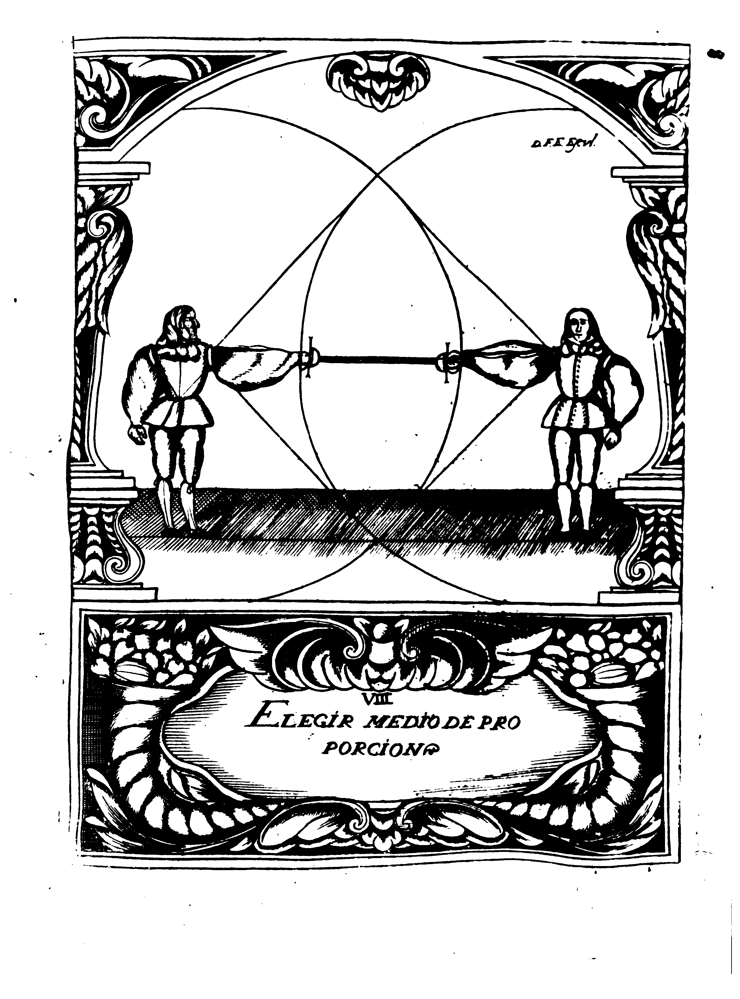

## Part III Chapter 1
### How to choose a Measured Proportion

Choosing a Measured Proportion is to determine a distance proportinal and agreeable from which the Dexterous can recognize the movements of the opponene, because for any decision he makes they must precede, as well of body, of arm, and of Sword.
Of body, by means of step, and of Sword by means of trained technique.

The way to achieve this is the following Demonstration, because it clearly manifests that in order not to err (rather to achieve perfection with success) the Dexterous must measure with his Sword that of his opponent, so that he does not pass the tip of the pommel, serving with this prevention, not only to recognize the Movements, but also to know if the opponent's Sword exceeds the length of his.
It should also be known that if the two Combatants find themselves with equal Weapons, the one who fist chooses the Measure does it for both of them, and is called the **Proper and Appropriate** Measure of Proportion, for having in a time chosed by himself and offered the same disposition to his opponent.
But, if one of them brings a longer Sword and chooses for him the form that we talk about, it is called the **Proper** Measure of Proportion, for having been chose by him alone, leaving the other disproportionate.
And if he who has the shortest Sword, his point comes to the opposite gurad, it is called **Appropriate* Measure of Proportion, because it applies (?) and he offers the Measure that he has not chosen, however one must be aware of all this, only the election of equal weapons will be demonstrated for being as we must now.

In the absence of the Measure of Proportion, there is a Principle of Proportion, because it's necessary for it to cease being one, to begin being the other, and to become better in its knowledge, it is necessary to understand the the Proportionate Measure is a distance, which the Dexterous determines, and from which he can hurt his opponent leaving him in defense. 
It is not, nor it can be one, because as different dispositions of injure are offered, one can not comprehend with only one, with which it is necessary, that for any kind of Technique there must be a defined Measure of Proportion given, every time that he is in a position from which he can offend, while being defended, he has succeeded with ease.

There are three ways to achieve this Measure, whom we call, Proper, Appropriate, and Transferred. The Proper Measure of Proportion is the one that the Dexterous acquires by himself when the opponent awaits him. The Appropriete, is the one that offers the opponent, when with his Movements he is in a disposition to hurt without risk. And the Transferred, is the one that the Dexterous takes from his opponent, opposing him with his steps and Movements, so that he comes to take for himself the Measure that the other sought.

Considering our Master's realized that and said: That is called Measure of Proportion because it lacks all of us. Proportionate, because the movement that the Dexterous will do, must be with such measure that is neither on the superfluous, nor is lacking on what is necessary. 
And to ponder his greatness he said more; that it is true that the one who comes to be constituted in the perfection, gets with this Science, for it is none other than the one offered by these means, assuring self-defense and attack the opponent.
And so, place, and reconsider the Dexterous, in what to acquire knowledge of the importance of these means is warned, we will continue with the opposition if the Angles and of other Principles, as well as their order.

TN:
* Medio de Proporcion: average proportion