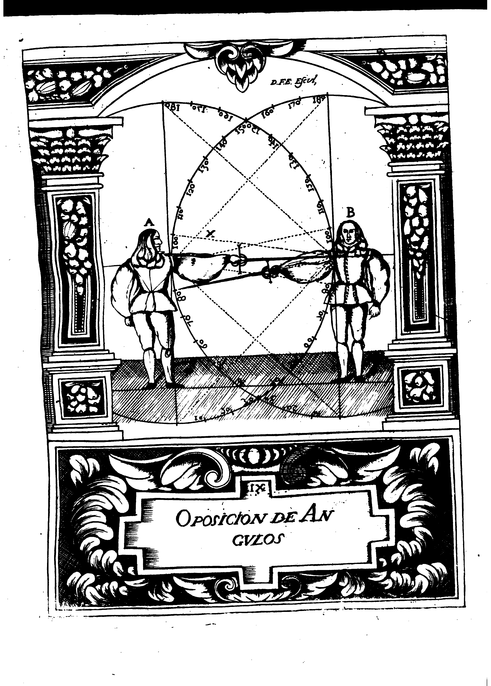

## Part III Chapter 2
### Of the Opposing Angles

The Right Angle, for its greater reach and defense, opposes the Obtuse and Acute Angle, and as it's impossible that if one of the combatants chooses it, the other can do it (because there is only one line where it is considered and it's occupied) he is forced to participate in one of the other two species, which, because it is of less reach, can't injure or avoid the wound of the one who is in Right Angle.
But in order to better prevent what is proposed, it will be practically demonstrated by this proposition, where the Dexterous recognizes the profitable fruit that actually offers the geometric measurements. because by the division of the circle, for the graduation and values of angles, one arrives at the knowldge of being able to counter one another (TN: the angles), and also of the well known mistake of those whi, without any reason, say that it is possible to injure from the Right, to Right, without warning, that if one of the combatants affirms himself perfectly, he can not obtain it by any other means, because the Upper Diameter Line (whis is where stands the arm and the Sword) is not capable of admitting them both.
And in order to clearly understand the Demonstration, it is to be noted that the figure indicated by the letter (A) is the one in the Right Angle, and the one that is shown by the letter (B) must necessarily participate in one of the other two angles that have less reach.

From the foregoing Demonstration it is also notes the manner of wounding, which we call because of where the Right Angle injures the opponent in the closest Point of Touch, which is considered where the arm is joined to the body, in such a way, that creates a Straight Line, from the one shoulder to the other of Combatants, and the Sword, perfectly accomplishes the obligation of injunction to injure, because of the Right Angle, as manifested by the graduation of the Circle.
As it is seen that the tip of his Sword is in complementary relation of the ninety degrees that touch him, and the opponent is forced not to reach this number, by putting his sSword at the Acute Angle, occupying the nymber of eighty degrees, or passing the ninety, tilt to the Obtuse Angle, putting the Sword in complementary relation of one hundred degrees occupying Line (X), remaining by any chance with less reach, not being able to cause an injury.

The Obtuse Angles are countered by their own category of angles depending on the degree of they have, and understand that more degrees are countered by less degrees, as the Demonstration teaches, admit, and consider, that the Obtuse Angle of hundred degrees will oppose the one with hundred and thirty degrees, by being closer to the Right Angle, and participates to major reach the closer it is to the Right Angle.

The same counte allows the category of Accute Angles, but it is with the difference that those of more degrees counter those of less, and thus the Sharp Angle of eighty degrees will have more reach that that of fifty for the same reason that has been said of the proximity to the Right Angle with which counters the more distant.
