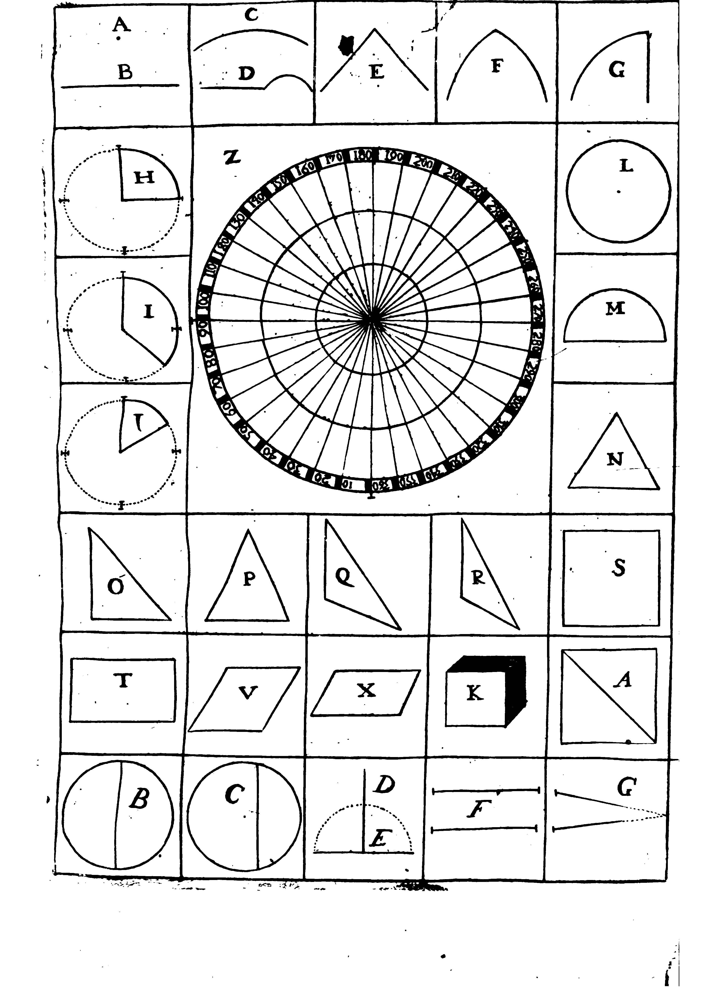

## TRATADO PRIMERO
### De los Principios de la Geometria, necessarios en Destreza, para el conocimiento de las Demostraciones, e inteligencia de los Terminos

La primera cosa que se nota en la Geometria, es el Punto, por ser de quien depende todo lo demas.
Euclides le difine, diziendo: Punto es aquel, cuya parte es nunguna.
Pero para que con mayor claridad nos expliquemos, digo: Que el {p. 2} Punto, es la mas delgada nota que se pudiere hacer, poniendo la pluma sebre el papel, y le muestra la letra (A) en la primera Demonstracion.

Siguese al Punto la Linea , la qual no tiene otra cosa que longitud, que es lo mismo que largura; y asi hemos de considerar una muy sutil raya, compuesta de unos delgados puntos.
De tres modos son las Lineas: unas se llaman Rectas, otras Curbas, y otras Mixtas.
La Recta, es la breve extension de un punto a otro: Son Regulares porque siepre se tiran de un modo.
Vese anotada en la siguiente Demostracion, donde senala la letra (B).
La Curba, es la que en su viaje va torcida, de forma que no esta igualmente entre dos Puntos, y se demuestra con la letra (C).
La Mixta se compone de la Recta, y de la Curba: Son Regulares, o irregulares como tambien la Curbas: en la figuiente Demonstracion se ensena con la letra (D).

De las Lineas se forman los Angulos, {p. 3} quando llegan dos a cocurrir en un Punto advirtiendo, que si se compone de Rectas, se llama por esta razon Rectilineo (E).
Si de Curbas, Curbilineo (F). 
Y se de una Linea Recta, y otra Curba, se llama Mixto (G).
En la siguiente Demonstracion lo manifiestan las letras.

Tres son las especies de Angulos que ay, Recto, Obtusi, y Agudo. 
El Recto es, el que comprehende (en la capacidad que ay entre las dos Lineas) la quarta parte de la circunferencia, que puesto el compas en el punto del cocurso, se pudiere hacer (H).
El Obtuso es, el que coge mas que la quarta parte (Y), y el Agudo es que coge menos (j).

Los Angulos Obtusos, y los Agudos, no tienen Puntos determinados, por cuya causa pueden ser mas, o menos Obtusos, o mas o menos Agudos. Y assi, para poder darles los valores, y graduaciones, es necessario hacer una Demonstracion, que con facilidad {p. 4} de la inteligencia.
Sea, pues, un circulo, el qual ha de estar dividido en trecientas y sesenta partes iguales, a quien llamaremos grados; y se reconocera, q al Angulo Recto, por no coger mas que la quarta parte de el, es preciso le toquen por Punto fixo noventa grados; porque si pasa un grado de los noveta, se mudara de la especie de Recto a la de Obtuso, por coger mas q la quarta parte: advirtiendo que todo lo que se fuere aumentando el numero, tanto se ira acrecentando el Angulo, teniendo tambien por cierto, que si baxa un grado de los noventa, pasara a la especie de Agude: con la misma advertencia, de que quanto fueren declinando los Grados, tanto se ira minorando la capacidad al Angulo.
Sacase que con esta prueba se puede dar medida, y valores a los Angulos, viendo la parte de circulo que cogen, y reconociendo los grados que en su capacidad se comprehenden.
En la primera Demonstracion se anota con la letra (Z) {p. 5}.

La superficie se compone de Lineas.
Tiene logitud, y latitud, q es lo mismo q largo, y ancho.
Es de tres generos, Plana, Concava, y Combexa; la Plana, es como la tabla lisa, la Concava, es como la guarnicion de una Espada por dentro; y la Combexa, como la quarnicion de la espada por fuera.

La figura llana, no es otra cosa que una superficie cerrada, que si se compone de Lineas Rectas, son necessarias tres; porque con menos no se podra formar: y por esta causa es el Treangulo la moner figura que consta de tres Lineas, terminadas en tres Puntos, de cuyo concurso se forma tres Angulos; pero si se forma de Linea Curba, con solo una se hara figura: la qual se llama Circulo; y el Punto que esta en medio, Cetro; y la Linea, circunferencia.
Tambien se puede con dos Lineas formar figura, pero avra de ser la una Recta, y la otra Curba, y se formara un medio circulo, o porcion de el, mayor, o menor.

{p. 6}

El Triangulo puede ser de muchos modos: y assi, para que no se ignore esta noticia, los ire demonstrando, y dando los nombres que a cada uno tocare.

Si el Triangulo constare de tres lineas, Rectas, iguales, lo seran tambien sus Angulos, y seran todos tres Agudos, y su nombre es Equilatero. 
Demuestrale la letra (N).

Si el Triangulo tuviere un Angulo Recto, y dos Agudos, se llama Ortogonio (O).

Si el Triangulo tuviere dos lados iguales, y uno desigual, sera su nombre Ysoceis y le anota la letra (P).

Si tuviere un Angulo Obtuso, y dos Agudos, se llamara Ambligonio, y le muestra la letra (Q).

Si todos los lados fueren desiguales, se nombrara Escaleno, y se muestra con la letra (R).

Al Triangulo sigue el Parallelo Gramo {p. 7}, que consta de quatri Angulos, y quantro lados, que cada dos opuestos son Parallelos.
Si todos los Angulos son Rectos, se llama Rectangulo, como (S) y (T).

Si el Rectangulo tiene los quatro Angulos Rectos, y todos los lados iguales, se dize Quadrado (S).

Si los lados son desiguales, sera Rectangulo prolongado (T).

El Parallelon Gramo que tiene los Angulos desiguales, y los quatro lados iguales se dize Rombo (V) y si los lados son tambie desiguales, se llama Romboide (X).

A las figuras llanas, sigue el cuerpo solido, el qual tiene tres medidas, Longitud, Latitud, y Profundidad, que es lo mismo q largo, ancho,y hondo: y assi, como la figura llana se forma de lineas, el cuerpo solido se compone de superficies.
Y para que no falte esta noticia, demostrare la figura, que mas facilmente los pueda dar a entender.
Sea, pues, el Exaedro, que se compone de {p. 8} seis Quadrados, y tiene seis caras, como manifiesta la siguiente figura, anotada con la letra (K).

Teniendo ya el conocimiento de estos terminos, que son las quatro partes que forman el cuerpo de la Geometria, sabiendo que la Linea se compone de Puntos.
El Angulo, y la superficie de Lineas.
Y el cuerpo solido, de superficies; trarare de declarar los nombres de las Lineas Rectas, con que hemos de dividir las figuras llana: y assi, si un Quadrado se divide con una Linea Recta que atraviese de un Angulo a otro, se llamara Diagonal (A).

Si un Circulo se divide en dos Partes iguales, con una Linea Recta que pase por el Centro a tocar en las Extremidades de la Circunferencia, se llamara Diametro (B).

Si se dividiere un Circulo en dos Partes desiguales, con una Linea q no pasa por el centro, la llamanos Cuerda, y es menor q el {p. 9} Diametro, a la parte mayor, porcion mayor; y a la menor, porcion menor (C).

Quando una Linea Recta cae a plomo derechamente sobre otra, se llama Perpendicular (D), y la que la recibe Basis (E).

Otras Lineas Rectas ay, que se llaman Paralelas, que son las que se tiran igualmente, distantes la una de la otra: de suerte que aunque se alarguen en infinito, nunca llegan a juntarse (F).
Otras se llaman concurrentes, por inclinarse mas a un lado que a otro, y en largo, o breve espacio concurren en un Punto, y forman angulo (G).

Todo lo difinido, y demostrado, son los primeros rudimentos de la Geometria, tan necessario, y preciso su conocimiento al q huviere de ensenar la verdadera Destreza, como al que la huviere de apreder: pues el que ha de explicar, no puede sin ellos dar a entender con fundamento, y claridad los terminos de esta Ciencia: y no siendo assi, tampoco podra aprender con gusto, ni saber {p. 10} con perfeccion el que huviere de ser enserado: por cuya cusa ha sido preciso dar esta breve noticia, que aunque solo es delos principios, es la bastante, para poder esperar conseguir el inteto de difinir, y demostrar las proposiciones de la verdadera Destreza, con algun acierto: y para dar principio a ello, sera bien constituir al Diestro en la posicion, y plantan as segun su difinicion, que le forma en la manera que adelante se propone. 

