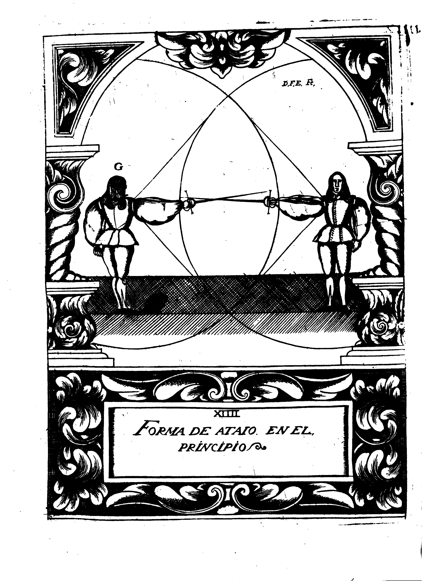
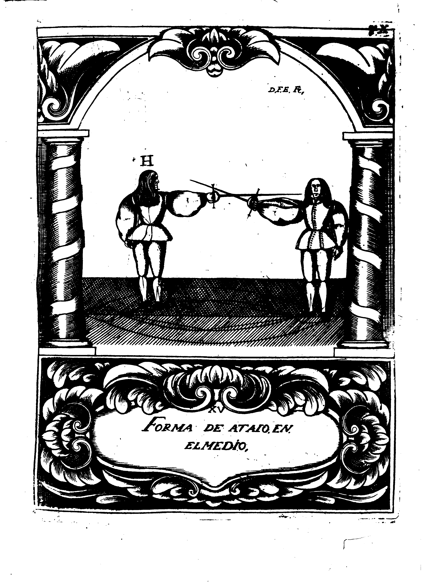
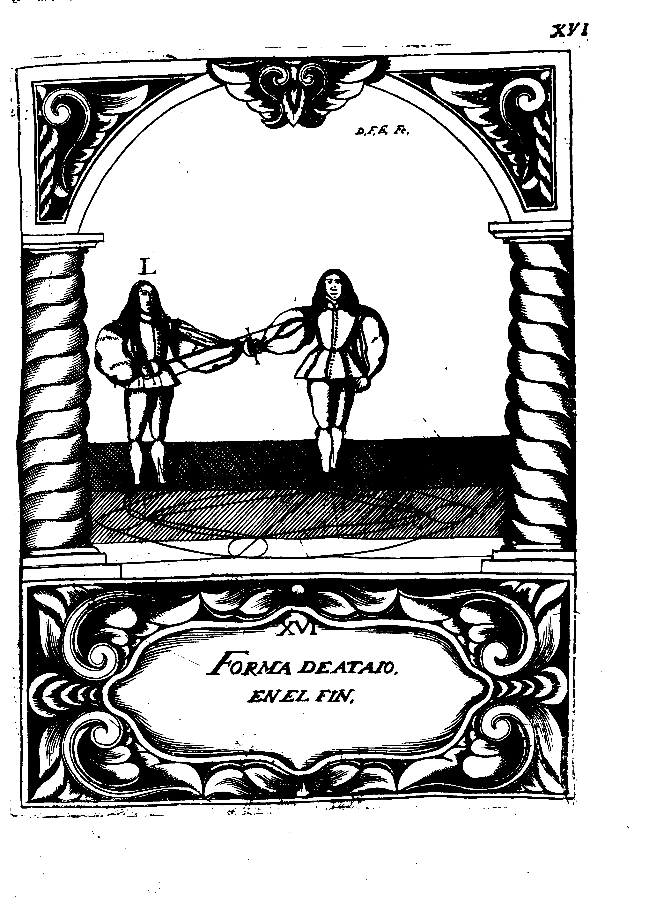
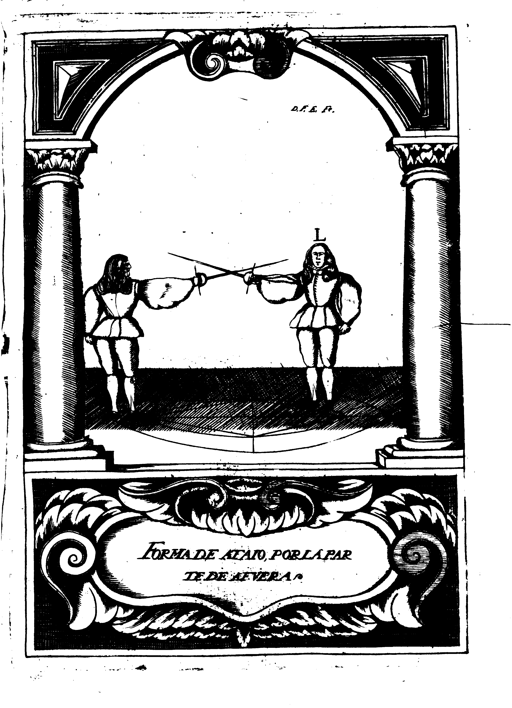

## Del Atajo

Varias, y diversas opiniones he reconocido, en el sentir de la estimacion que se debe dar al Atajo, segun su potestad, y superioridad; porque los que {p. 130} ciegamente se persuaden, a que es Treta Universal, dizen, que le toca la mas superior: Otros no le dan tanta; porque dizen, que el modo de ponerle, que aora se practica, no es como debe ser (esto nace de reconocer algunos inconvenientes) pero siempre estan confirmes esperancas, de que en algun tiempo puede ser se logre el ponerle de suerte, que con satisfacion se puede dezir, que es Treta Universal: y para la seguridad de conseguirlo, se aplican con todo es fuerco al trabajo, y cuidaddoso desvelo, sin considerar lo dificil de la empresa; pues es lo mismo, que los que inadvertidos quieren hallr el Movimiento continui, o la Piedra Filosofal.
Pero para que se persuadan, y reduzcan a la razon, y dexen de gastar el tiempo en tan insubstancial aplicacion, quiero referir algunas Observaciones, que de los Unicos Escritos de nuestro Maestro tengo hechas, donde con superior Magisterio prueba, que no ay Treta Universal en lo {p. 131} practico de esta Ciencia, para que los que dizen que el Atajo lo es, queden desenganados: y los que confiesan que no la ay, pero que la puede aver, no gasten en semejante dedicacion el mas minimo rato.
Y asi digo que en el fol. 22. del libro initulado Engano, y Desengano de la Destreza, y Filosofia de las Armas; despues de aver satisfecho, y probado con fundamentales, y concluyentes razones la fuerca de este dictamen, todo necesario para desvanecer semejante herror, dize (afirmativamente) que es impossible, que en la parte practica de esta Ciencia, pueda aver Treta Universal, ni que tampoco es necesario averla; porque si el contrario (en la comun razon de hombre, por la forma de su composicion, organicacion y finito poder) esta naturalmente privado de poder en un tiempo afirmarse en todas posiciones, y rectitudines, ni hacer todas la especies de Movimientos, y Compases, y herir con todas las especies de {p. 132} heridas, sino que antes le ha de ser forcoso hazer qualquiera de estas cosas, en tiempo divido, y distinto, dexando de ser lo primero, para poder introducir el ser de lo segundo, que es sin duda, que particular impedimento sera bastante para remediar qualquiera determinacion, sin ser necesaria Treta Universal.
Y prosigue, diziendo en el fol.23. Que aunque fuera possible, que en la parte practica de la Destreza huviera Treta Universal, que no lo podia ser el Atajo.
Y apurando mas este Punto, dize en el mismo folio: Qhe el Atajo, no es Treta; que solo lo son el Tajo, el Reves, y la Estocada, el medio Tajo, y el medio Reves; de cuyas causas proceden los efectos de herir, y matar: y que el Atajo es defensa contra la Treta, por causa de la sugecion.
De donde se infiere, que para ser Treta, avia de construir herida precisamente.
Esto no es, ni puede ser, sino que antes son sus efectos contrarios; con que con evidencia se prueba, {p. 133}, que lo seran tambien las causas.
Y asi con toda firmeza, y fundamento se puede dezir, que no tan solamente no es Universal, sino que tampoco es Treta particular, pues le falta la potestad de poder ocasionar ofensa, por medio de la execucion de la herida.
Y para que de todo punto queden persuadidos, y desenganados, aprovechense del consejo que en el fol cinquenta y dosda a todos los que se emplean en semejate especulacion, deziendoles: Que no gasten el tiempo en havcer necios, y nuevos disevsos, queriendo que en la parte practica de esta Ciencia aya Treta Universal; porque sera trabajo inutil.
Y en resolucion, destel unto digo: Que si fuera possible hallar Treta Universal (la qual supone una cabalplenitud, y complemento de todo lo que cabe en la humana possibilidad) que era reducir al concurso de un Punto fixo todo quanto en la Destreza puede ser hecho (asi de la defensa propia, como de la ofensa de {p. 134} el contrario) cortando las Lineas al infinito campo de la Ciencia, y convirtiendola en un Arte mecanica, pues seria capaz qualquiera de poder aprehender, y ponerse en su conocimiento en brevissimo tiempo, que dando hecho dueno absoluto de todo, y consumadamente Diestro.
Esta materia es tan impossible, como se reconoce; y asi, pues todas estas razones dispiertan con evidencia al conocimiento de tan manifiesto herror, espero, y tengo entera confianca, de que los que abrieren los ojos, para mirar desapasionadamente, lograran el desengano, y descanso, escusando el inutil trabajo de solicitar cosas impossibles: ye en esta seguridad continuare, explicando hasta que termino llega la jurisdicion del Atajo, para que con el verdadero conocimiento de su poder, se lede la estimacion que pareciere, advirtiendo primero, que el Diestro tiene dos caminos por donde dirigir sus determinaciones: el uno, que llama mos por la jurisdicion del {p. 135} braco de la Espada, pues por toda aquella mitad de la Circunferencia que le corresponde a su lado izquierdo, y al derecho del contrario, y las heridas se encaminan a los Puntos de la profundidad del cuerpo adversario: y el otro, llamos por los grados del perfil, que es siempre que por la mitad de la Circunferencia que le corresponde al Diestro a su lado derecho, se descubrieren las Lineas, y Puntos considerados en la Latitud del cuerpo contrario, siendo el medio de estos dos estremos, la Linea del Diametro conmun, considerada en la Planitud inferior.
Y por que damos principio al Atajo, haciendo agregacion por la parte de adentro, y caminando por la jurisdicion del braco de la Espada, no ha sido escusable esta advertencia, necesaria para tan precisa noticia, que teniendola ya, junto con su verdadero conocimiento, prosigo sin embaraco.

Para poner el Diestro Atajo, es necesario {p. 136} no ignore, que esta disposicion se divide en Principio, Medio, y Fin, por cuya causa ay tres diferentes consideraciones de Atajo.
La primera es, quando desde el medio de Proporcion pone su Espada sobre la contraria, haciendo tocamento con superiores, o iguales grados; y entonces, por causa de la distancia, se ocasiona una comun privacion.
La otra es, quando se quebranta el Medio de Proporcion, y mediante el Compas Transversal, se llega al Proporcio nado a poder ocasionar ofensa; y entences causa dos efectos, que son, el de privacion al contrario, para poder herir inmediatamente; y el de disposicion al Diestro, para poderlo hacer.
La ultima es, quando se llega al estremo propinquo ahacer Movimiento de conclusion; e entonces se ocasionan tres efectos, que son, el de pribacion, y sugecion al contrario, y el de disposicion al Diestro, para poder herir inmediatamente.
A este estremo llega la jurisdicion del Atajo {p. 137}, pero me parece ser precisa mayor especificacion de lo propuesto, y fundar en razon la causa de donde proceden semejantes efectos.

Aviendose de dar principio al Atajo (que es lo mismo que a impedir, y embaracar las acciones, e intentos del contrario) es necesario que aya la disposicion conveniente, que es hallarle afirmando en razon de Angulo Recto (segun su definicion) presentando la Espada, y ocupando con ella la Linea del Diametro superior; porque si falta, no avra en que poder obrar; pero en suposicion de que la ofrece con toda conveniencia, digo: Que se debe elegir Medio de proporcion, y luego, sin Movimiento alguno del cuerpo, sino solo del braco, y Espada, ponerla sobre la contraria numero seis superior, sobre conco inferior, procurando siempre, que el cuerpo este detras del braco, y la Espada, y la punta de ella, lo mas correspondiente al contrario que possible fuere, y poner el pie izquierdo {p. 138} de suerte, que el talon corresponda a la punta del derecho, ocupando una Linea infinita, para tener grangeada mucha parte de la distancia, y que el Compas Transversal sea mayor de lo que fuera, si el pie izquierdo estuviera detras del derecho, quedando en la forma que la presente Demostraccion ensena, por la Figura (G).

{p. 141}

Hallandose el Diestro en la conformidad que representa la Figura, se conoce, que ha dado principio al Atajo, y que respeto de la distancia se considera una cemun privacion; pues asi el uno, como el otro, no son capaces de poder obrar cosa alguna (inmediatamente) que pueda ocasionar ofensa, sin preceder primero nuevas disposiciones, por medio de los Compaces, y Movimientos; pero desde este principio se pasa a conseguir el Medio, dando un Compas Transversal por el lado izquierdo, todo lo mas ajustado que suere possible, y en el mismo tiempo ir haciendo sugecion con el Movimiento Natural (por no perder la superioridad) hasta ponese en parage conveniente, y proporcionado de poder herir solo con el Movimiento Accidental, tenniendo para ello la distancia necesaria, segun la siguinte Demostracion represanta, por la Figura (H)

{p. 145}

En la forma que la antecedente Domstracion ensena, debe estar el Diestro, qundo aya logrado el llegar a los Medios del Atajo, a ocasionar los efectos de privacion al contrario, y de disposicion para si, pues mediante la superioridad, le reduce a termino de no poder formar mas que Reves, medio Tajo, y Estocada (si acaso quiere ocasionar ofensa) teniendo el Diestro disposicion de poder herir en el tiempo de su formacion, oponiendose con la Trera de Estocada: y si acaso se resolviere a esperar, sin formar cosa alguna, permaneciendo en el propuesto estado, por breve tiempo que sea, debe con toda promtitud herir, ocupando el Punto de Tocamento de la Linea Colateral derecha: y si acaso, por tener alta la guarnicion, estuviere cubierto, se podra executar debaxo del braco, en la quarta parte del Circulo, siendo seguro, que para uno de los dos Puntos ha de aver disposicion, po no ser possible, cubrirlos ambos en un tiempo.
Con que logrando {p. 146} el Diestro esta ocasion, consigue el Medio Propercionado propio, pues sin gozar de Movimiento alguno, ocasiona la ofensa, quedando defendido; pero si por parecerle al contrario, que conviene para su defensa el tomar determinacion de formar Reves, poniendo su Espada en actos Dispositivos, por no serle possible herir inmediatamente, lo podra hacer el Diestro con toda seguridad, en los tres tiempos de Principio, Medio, y Fin, en la forma que en la oposicion de las Tretas queda advertido, y practicamente demostrado, gozando de los Movimientos de su composicion.
Y si acaso diere principio a la Formacionde Medio Tajo, puede impedirsele la execucion en la misma conformidad, gozando del Movimiento Remiso, y demas dispositivos.
Y por ultimo, si quisiere salir de la sugecion, librando de la Espada, para constituir herida de Estocada, por la partede afuera, le ha de ser forcoso hacer una accion Circular, que conste {p. 147} de quatro especies simpes de Movimiento haciendo un Mixto de todos quatro por cuya causa es sin duda la oposicion del Movimiento Accidental, hiriendo en razon de Angulo Recto, con que es indubitable que en todas estas ocasiones se hace, que por medio del Atajo ofrezca el contrario Medio Proporcionado Apropiado; pues aprovechandose de los Movimientos que forma, se goza de la ocasion de herir, que dando asegurada la defensa de suerte, que con toda evidencia se reconoce, que tiene el Diestro cumplida disposicion, y su contrario conocida privacion de poder ofender con Movimiento inmediato; pues mediante el Atajo, le obliga, y reduce a la formacion de acciones Circulares, y Dispositivas, en cuya oposicion puede aprovecharsela real seguridad del Angulo Recto, ocasionando la ofensa, por medio del Movimiento Accidental.

Despues de aver pasado los Medios, se {p. 148} prosigue a conseguir fines, a donde se reconoce la perfeccion, o imperfeccion de la obra.
Y pues se esta en terminos de tratar del Atajo en su fin digo: Que le tiene quando el Diestro, desde el medio (que es donde le consideramos en la antecente Demostracion) pasa dando Compas Curbo con el pie izquierdo, y ocupa con el cuerpo  la capacidad del Angulo Agudo, que de el tocamento de las Espadas se ocasiona, a quien propiemente llamamos, Angulo Interior, por la correspondencia que tiene con el cuerpo; y luego en el mismo tiempo sugeta con la mano izquierda la Espada contraria, haciendo la poderosa accion del Movimiento de Conclusion, y quedando en la forma que por la presente Demostracion ensena la Figura (L)

{p. 151}

Al termino significado por la antecedente Domostracion, puede llegar lo que cabe en la humana possibilidad; pues constituyendose en tan superior estado, quedara qualquiera satisfecho, de que logra el Diestro el con seguir los tres efectos de Privacion, Sugecion, y Disposicion, pues mediante el Movimiento de Conclusion, priva, y sugeta Generalmente a su contrario, quitandole la causa instrumental (que es la Espada) y el queda con disposicion segura de poder obrar a su voluntad, disponiendo lo que mas conveniente le pareciere; pues no tiene oposicion que le pueda ocasionar el mas minimo embaraco.

Que estas Disposiciones, o Medios (como queda dicho) se ayuden los unos a los otros, con admirable conformidad, y conveniencia, no es materia reparable, por ser cosa constante, que sin la disposicion del Angulo Recto, no podra aver Atajo, porque faltara materia sobre que introducir la forma, {p. 152} ni tampoco sin la disposicion de Atajo, podra el Diestro herir en razon de Angulo Recto sin conocido riesgo de ser herido, aunque hiera: ni se puede lograr con seguridad el Movimiento de Conclusion, sin preceder el Atajo, que asegure la entrada del cuerpo a ocupar el Angulo Interior que le corresponde; ni tener fin perfecto el Atajo, sino se hace Movimiento de Conclusion, por no ser possible si falta, ocasionar los tres efectos de privacion, y sugecion al contrario, y de disposicion al Diestro, que infaliblemente son los que le constituyen en el termino de la perfeccion.

Por todas las razones referidas, parece se dar motivo a la persuasion de que el Atajo es Treta universal; pues en la consideracion de sus Principios, Medios, y Fines (segun queda explicado, y reducido a la practica Demostracion) se halla una total destruicion del contrario, y una infalible superioridad del Diestro; pues vemos le reduce {p. 153} a tan inferior termino, que si se resuelve a esperar, permaneciendo, tiene evidente el peligro: si determina formar Treta, reduciondose en actos dispositivos, tiene asegurado el riesgo; y si a querer conseguir la defensa, quebrantando, y desminuyendo la distancia, para quitar el alcance, usando de la violenta accion del retroceder, por medio del Compas Estrano, bien se ve lo inutil de la determinacion, pues no es de efecto alguno, por la oposicion que con el Recto se hace caminando naturalmente azia adelante.
Con que parece con evidencia, que el Atajo ofrece al Diestro Universal plenitud de dominios: y al contrario, Universal privacion de todo, por cuya causa parece se debe justamente tener por Treta Universal, pues por lo hasta aqui propuesto, y manifiesto sobre este Punto, tiene razon aparente esta proposicion, pero para desvanecerla, y a purar claramente su verdad, es necesario poner toda atencion en lo que adelante {p. 154} se fuere proponiendo, y fundando en razon; y asi con todo encarecimiento encargo su eseculacion, y observacion para mas bien prevenir la importancia de su conocimiento.

Para mejor poderme explicar, tengo por necesatio, que en esta ocasion se truequen las acciones de los operantes, y que asi como hasta este tiempo hemos considerado al Diestro en la formacion del Atajo, siendo en todo Actor, le consideremos paciente, y que su contrario sea el que con accion activa intente ponersele en la forma que se ha difinido, y demostrado: y que el Diestro sea quien procure estorvar su execucion, con la aplicacion de superiores oposiciones, consiguiendose con esto el conocimiento del valor del Atajo, y lo que contra el se puede hacer, para minorar la relebante, y unica estimacion que tiene, y quede acrisolada la verdad de su poder.

Con muy segura confianca estoy, de que {p. 150} con bastante satisfacion se avra reconocido, que el Atajo ocasiona sus efectos, por medio de una superior graduacion, y de un superior poder del Movimiento Natural: y tambien de que se me concedera, que si fuese possible vencer, y destruit estas dos causas, veriamos desvanecido el fin de tan superiores efectos: y asi, para la oposicion de el Atajo en su principil condicion que se pidio para ponerle, fue la necesaria disposicion de que la Espada huviese de estar en razon de Angulo Recto, por ser sin duda, que si faltase no se le podria dar principio, se reconoce con toda razon, que se quando el contrario quiere ponerle, se le quita la Espada del termino conveniente, no le sera possible conseguirlo: conque no ofreciendola, se destruye la potestad de esta disposicion, pues faltando la introducion de su ser, faltara el rigor de los efectos que podia ocasionar la superior graduacion {p. 156} en el tocamento de las Espadas.
Esto se puede observar, quando desde el Medio de Privacion comun, se diere Principio; porque respecto de no aver alcance, se puede quitar la Espada del perfecto termino, sin riesgo alguno, el qual tuviera conocidamente el Diestro, si tal accion hiciera, aviendo llegado su contrario al Medio Proporcionado; porque respecto del alcance, podria herir en razon de Angulo Recto, en el mismo tiempo que la Espada le faltase; pero pues en el principio se desvance el Atajo con tanta facilidad, no consintiendo la generacion de sus primeras formas que le han de introducir el ser, pasaremos a considerar los medios, que aunque con deferentes preceptos, tiene la misma facilidad su impedimento.

Supuesto aver llegdo a los Medio del Atajo, a donde por aver el Diestro dado lugar a su contrario a la introducion de los principios, le es ya inescusable la superior {p. 157} graduacion, y tocamento: causas que le han de ocasionar los efectos significados de pribacion para herir inmediatamente, y de disposicion al operante para poder lo hacer, caso que permanezca, sin aplicar los superiotes preceptos, y fundamentales reglas, que consaludable providencia tiene prevenido el Arte, digo, que me parece necesario que el Diestro, con toda solicitud, procure valer se de ellas, para la defensa de su persona en el aprieto presente.
Y para la sarisfacion de lo propuesto, y considdrrandole ya en la forma que la penultima Demostracion nos manifiesta, buelvo a hacer memoria, y poner en nuevo conocimiento, de como por la oposicion de grados de Espada quedo inviolablemente probado, que los mayores dominan sobre los menore, por las razones referidas en los principios fundamentales, y universales de que siempre nos hemos de valer; y asi mismo de que tambien queda probado fundamental, y concluyentemente {p. 158}, que mediante la graduacion, se le quita el superior poder al Movimiento Natural, violentando el Arte la potencia de su naturaleza, para que esto asegurado, pueda el Diestro (pues reconoce, que la causa de su inferioridad es la superior graduacion, y Movimiento) prevenir la defensa, abriendo el Angulo con el Movimiento Mixto de Violento, y Remiso, dandole mas capacidad, y mundandole de la especie de Recto a la de Obtuso, lo que suere necesario para hacer el Movimiento de Aumento Propio, y de Diminucion Apropiado a su contrario, consiguiendo con sola esta accion el destruir la graduacion, y fuerca operante, obligando a que caigan sus menores grados sobre los mayores de la Espada del Diestro, no pudiendo en tal caso obrar nada el Movimiento Natural; con que vemos indisputablemente destruida la Superior Graduacion, y Movimiento Natural, y aver cesado los efectos de la privacion {p. 159}, y disposicion, por aver quitado la causa de donde procedian.
Y aun con toda satisfacion se puede dezir, que no solo ha selido el Diestro de la estrecha opresion del Atajo, sino que con evidencia dexa atajado a su contrario; porque si el estarlo da a entender accion passiva, en este caso se reconoce con toda firmeza que lo esta, por lo que tantas vezes refiere nuestro Maestro, diziondo: Que Agente flaco, sobre resistente fuerte, nohace, sino padece.
Aqui vemos la Espada del Diestra graduada, y la de su contrario con los menores grados sobre los mayores, siendo Agente flaco, sobre resistente fuerte, padeciendo, y no haciendo: en todo atajado, y quitada la disposicion de herir inmediatamente, teniendola el Diestro para poderlo hacer, cerrando el Angulo con el Movimiento Mixto de Reduccion Natural, y Accidental, y sin perder la union de la Espada (antes llevendola sugera) dar un Compas Transversal por el lado izquierdo {p. 160}, y a un mismo tiempo herir de Estocada, para dar a entender qual de los dos es el que esta Atajado.

Esta es la cerdadera, y perfecta oposicion en los Medios de Atajo, fundada en toda razon, y con manifiesta evidencia probada, por los principios fundamentales, y universales de esta Ciencia, y no el querer que se formen Reves, Medio Tajo, y Estocada, sin considerar el conocido riesgo a que se expone el que de causa sugeta los formate, por averse de reducir en Actos Dispositivos, y estar el contrario en potencia executante segun por las Demostraciones de la oposicion de las Tretas queda inviolablemente probado.
Y aun no satifecho de tan superior satisfacion, para mas firmeza de su inviolable observacion, digo (por constanto, y firme resolucion) que prevengo se tenga entendido, que de causa sugeta, ni a Espada parada, no puede aver Tajos, ni Reveses, medios Tajos, ni Medios Reveses, ni {p. 161} otros qualesquiera Movimientos Cirvulares, o Semicirculares, sin el prevenido riesgo, y el ir contra toda buena Doctrina; porque lo que con mas cuidado se previene, es que a los Tajos, y Reveses, los engendra el desvio que hace el contrario, siendo la precisa desposicion para la introducion de su forma; pues si aqui no se reconoce ningun desvio, sino un Atajo puesto al Diestro por su contrario; y asi mismo se sabe tambien, que el Atajo es sugecion, y que la sugecion es acto corruptivo, y privativo, y no generativo, ni disposicion para semejantes Tretas?
Y no aviendola, como puede ser possible su formacion, sin asegurados inconvenientes?
Lo que aconsejo es, que en estos casos se hagan graduaciones, como tengo dicho, y se escusen los Tajos, y Reveses, si se quiere obrar con fundamento, y conseguir con felicidad el acierto.

La oposicion del Atajo en su sin (que es {p. 162} segun la ultima Demostracion nos manifiesta, aviendo llegado a hacer Movimiento de Conclusion) es materia imposible; porque quien dize llegar una cosa al fin, es lo mismo que si dixera; aver llegado al ultimo termino de la perfeccion, donde fenece, y acaba en un Punto, no quedando mas progreso para la sucession de mas Actos.
En esta preeminencia se halla constituido el Atajo, por medio del Movimiento de Conclusion, que aviendo precedido, y logrado tan poderosa accion, justamente se puede dezir, que ha llegado a consequir el fin con toda perfeccion.
Y como qualquiera cosa que tiene fin, dexa de ser; y lo que no tiene ser, es nada; y de nada ninguna cosa se hace, claramente se reconoce no poder hacer nada, por no aver nada en que hacer; pero en el intermedio que ay de los medios a los fines, se puede aplicar conveniente remedio, para que no llegue a semajante estremo.
Siempre nos ha de {p. 163} ser inescusable la graduacion para el logro del intento: y asi debaxo de su realidad, y conveniente defensa, se puede prevenir la oposicion, valiendonos tambien de la contraposicion de los Compases, que para semejantes ocasiones tiene prevenido el Arte.

Desde el medio para conseguir el fin, se pasa dando Compas Curbo con el pie izquierdo, y se ocupa con el cuerpo el Angulo Interior, y correspondiente, ocasionado del Tocamento de las Espadas, cuya especie debe ser agudo, y luego se hace el Movimiento de Conclusion, y se pone el pie derecho derras del izquierdo, y la Espada en el restro, o en la Linea Colateral derecha, como nos tiene manifiesto la ultima Demonstracion: y asi en esta consiferacion, y conocimiento, prevengo, y advierto, que quando el contrario llega casi al ultimo termino de los Medios, antes de empecar a proseguir a los fines, debe el Diestro dar principio a la prevencion de su defensa, no atriendo (?) {p. 164} el Angulo totalmente, como queda dicho, para la oposicion de los Medios, sino solamente bolviendo la mano unas arriba, principio para la graduacion; y luego en el mismo tiempo que el adversario, comencare a dar Compas Curbo con el pie izquierdo, para ocupar el Angulo, dar el Diestro otro Transversal con el pie derecho sobre el lado izquierdo, haciendo juntamente graduacion de Espada, quedando con el cuerpo perfilado, el braco firme, y estendido, la Espada graduada, demanera que la guarnicion cubra los puntos de la colateral, y rostro; y la punta este un poco remisa azia la rectitud derecha del Diestro, a cuya posicion llamamos esta el cuerpo detras de un Triangulo de dos Lineas Fisicas (que son el braco, y la Espada) y la otra imaginaria, que es la que se considera desde la punta de la Espada, hasta el ombro derecho, quendando el contrario en semejante caso, con el cuerpo de quadrado, descubriendo las Lineas {p. 165} de la Latitud; la Espada desgraduada, y sin poder hacer Movimiento de Conclusion, viendose obligado a valerse de una de quatro cosas, o a salirse por medio del Compas Estrano, al medio de Proporcion; o a no proseguir en el intento, sino quedarse en la conformidad referida; o a reducir su Espada en Movimiento, queriendo con el Accidental acometer, para herir de Estocada; o a querer recuperar la superioridad perdida, por medio de nueva graduacion.

Esto me pudiera ser bastante, para probar el aver destruido la potestad de el Atajo, pues sino fuera asi, no se viera necesitado el contrario a introducir nuevas formas: cosa que da a entender aver avido corrupcion de las primeras; como con superior verdad lo aprueba la Maxima segunda de la Destreza, que dize: Que donde quiera que ay corrupcion, ha sido la generacion antecedente; y que donde quiera que ay {p. 166} nueva generacion, precedio la corrupcion: Pero no obstante sera bien apurar el valor de estos quatro Puntos para reconocer el frutp que de ellos se puede sacar, y el provecho que pueden ofrecer al Diestro, para su Defensa.

El primero que previene la resolucion de salir al Medio de Proporcion, adonde se ocasionara la comun privacion de los combatientes, bien evidentemente da a entender, que el Diestro no esta atajado, sino en todo lobre, y igual con su contrario, y con potencia general de disponer a su voluntad, lo que para su intento guere mas conveniente, por hallar se sin sugecion, ni otra cosa alguna que le pueda obligar a que esto no sea.

El segundo que determina la permanencia en el estado propuesto, bien da a entender la realidad de la oposicion, pues a no ser de superior poder, no le embaracara al contrario la prosecucion del Dictamende {p. 167} lograr el fin ultimado del Atajo: y pues aquise ven fenecidas todas sus resoluciones, bien se puede dezir, que queda Atajado, porque si el Atajo, segun queda resuelto, es lo mismo que impedimento, y embaraco, por la oposicion se ve el embaraco, y estorvo que le ha ocasionado, quedando indeterminable, y suspenso en el referido estado.

El tercero, que propone el reducir la Espada en Movimiento Accidental, para herir de Estocada, dando Compas Transversal, no solamente le puede ocasionar al Diestro el menor peligro, pero antes admirable disposicion para su mayor seguridad, y riesgo de su contrario; porque considerando que se halla con superior graduacion, y en potencia de poder obrar contra lo que se redugere en Acto, se reconocera, que al mismo Punto que diere principio al Compas Transversal, y al Movimiento Accidental, debe el Diestro darle al Compas {p. 168} Curbo con el pie izquierdo, y al Movimiento Natural, haciendo sugecion, y ocupando el Angulo Interior, consiguiendo hacer el Movimiento de Conclusion: advirtiendo que han de ser tan en un tiempo todas estas acciones, que apenas aya de la una a la otra la mas minima distancia; por cuya razon se dize, tres acciones en un tiempo, hechas por Agentes distintos, que son; pie, para el Compas; braco, y Espada, para la execucion de la herida; y mano izquerda, para la Conclusion, logrando el Diestro en es te caso el Medio Proporcionado Transferido, por averle quitado a su contrario la disposicion de Atajo, que deseava conseguir, dexandole inferior paciente, y el agente superior.

El quarto, y ultimo Punto que persuade el intento de nueva recuperacion de la perdida superioridad, no ofrece menos disposiciones favorables al Diestro que las antecedentes, pues en la misma consideracion de {p. 169} que esta en potencia de obrar, y que su contrario se ha de reducir en Actos, se puede esperar que consiga oponerlos con acierto; y asi digo, que para la recuperacion de la perdida superioridad, es necesario nueva graduacion, y nueva sujecion: y para la nueva graduacion, es preciso que aya de dar Compas Transversal, y abrir el Angulo con demasiada desproporcion, para buscar superior Tocamento de mayores en menores grados; de cuyos Movimientos gocando el Diestro, puede herir de Estocada en la quarta parte del Circulo, oponiendo al Movimiento Violento (que ha de preceder para abrir el Angulo) el Accidental, y al Compas Transversal otro de su misma especie, saliendo luego al Medio de Proporcion, con el Compas Mixto de Trepidacion, y Estrano, aviendo herido instantanea, y no permanentemente.

En el tiempo de la sugecion, es tambien possible la oposicion, porque supuesto que {p. 170} se graduo el contrario, y que desde la graduacion ha de hacer la sugecion, cerrando el Angulo con el Movimiento Natural, y dando Compas Transversal con el pie derecho a su lado izquierdo, puede el Diestro, al mismo tiempo en que empieca la sugecion, bolver la mano unas abajo, y arquear el braco, y dar Compas Curbo con el pie izquierdo, y hacer Movimiento Conclusion: a cuya posicion de braco, y Espada, llmamamos Angulo Mixto, porque se compone de una Linea Curba, que es el braco que ha de quedar encorbado, como tengo dicho: y la otra Recta, que es la Espada, siendo el Punto del Concurso en la enpunadura: accion que ocasiona la desgraduacion de la Espada contraria; porque al mismo punto que se buelve la mano, el mismo impulso del Movimiento Natural, hace que caygan los menores Grados de fuerca, sobre los mayor es de la del Diestro: y como en este caso, y por esta razon queda desgraduado, y concluido, {p. 170} bien se puede dezir, que de todo punto esta sugeto y privado.

Esta es la satisfacion de los quatro Puntos propuestos, no pareciendome queda que dudar en sus oposiciones, ni en la del Atajo, en los tres tiempos referidos, pues con toda la fuerca de verdad possible (segun de los principios fundamentales, y universales devemos creer) se ha probado concluyentemente, que la graduacion de Espada hecha con el Movimiento de aumento propio, ocasiona la desminucion de Grados, y de fuerca al contrario, destruyendo la superioridad del Movimiento Natural.
De donde se saca por firme consecuencia, que si el Atajo no es otra cosa que superior graduacion, y superior Movimiento, y Tocamento, que sera vencido, y desecho, abriendo el Angulo por medio del Movimiento de Aumento propio.

Tambien me parece advertir (para mas claridad, y manos confusion) que aunque {p. 172} nuestro Maestro D. Luis Pacheco de Narbaez, explica siete formas, o modos de sacar la Espada del lugar peligroso, que todos siete se cifran en dos, que son la graduacion, y la disminucion de distancia, por la evidente razon de que la Espada nunca esta, ni puede estar en lugar peligroso, sino es quando esta sugeta, y atajada por la contraria: y en estos casos, ya se sabe, que solo la graduacion la puede sacar del peligro, como queda advertido, y bien probrado.
Y si acaso, junto con la Espada, estuviere tambien el cuerpo en riesgo, sera preciso hacer a un tiempo la Graduacion de Espada, y la Disminucion de Distancia, por medio del Compas Mixto de Trepidacion, y Estrano.
Y pues a esto se reducen las siete formas de sacar la Espada de lugar peligroso, como tengo dicho, observese simpre, que solas las dos debe tener el Diestro por unico preservativo de la rigurosa sugecion, que con poderoso impulso le pusiere su contrario {p. 173}, pues con taanta satisfacion le afianca los aciertos, y ofrece seguridades en la oposicion de la relebante disposicion del Atajo, frustrando su poder, y dominio, corrompiendole sus formas, y haciendo no ser ningunos sus efectos, por aver quitado las causas de su origen, dando con esto satisfacion a las embanecidas opiniones, que se persuaden, a que es Treta Universal, representando el inferior estado en que le ponen, que a ser cierto, nofuera possible; pues como dize la Maxima 43.
Que lo que es universal, no puede estar incluso.
Y pues aqui le vemos incluido, debaxo de superiores disposiciones, que le reducen al no ser, bien sepuede dezir, que no es universal.
Y en resolucion, se consigue el dar a entender, que si tiene poder contra las inconsederaciones de los operantes, que no tendra culpa la Ciencia, pues previene medios superiores, para que obrando el Diestro con su conocimiento, pueda lograr lo que con tantas razones {p. 174} queda explicado, y manifiesto.

Por medio del Compas Transversal de mano derecha, y de superior agregacion, por la parte de afuera (hecho todo en un tiempo) se pone tambien Atajo, pero en todo son inferiores sus efectos, a los que ocasiona el de la parte de adentro; y debe considerarse su formacion de esta suerte.

Aviendo el Diestro elegido Medio de Proporcion con su contrario, y determinado ponerle Atajo, por la parte de afuera, le ha de dar principio, pasando con su Espada por debaxo de la guarnincion de la del contrario, descriviendo una porcion mayor de Circulo, hasta poner la superior a la del adversario, haciendo Tocamento con numero ocho, sobre seis, y dando Compas Transversal con el pie derecho, y a su lado; y juntamente haciendo sugecion con el Movimiento Natural, y fuarca operante, procurando que en el Tocamento, Sugecion, y Compas, no aya distincion {p. 175} de tiempo, sino que sola una accion incluya en si todas estas tres, quendando con el cuerpo perfilado detras del braco, y la Espada en la forma que la Demostracion ensena, por la figura (L).

Segub la antecedente Demostracion nos manifiesta, se reconoce, que por medio del Compas Transversal de mano derecha, ha logrado el Diestro distancia proporcionada, para poder herir a su contrario, por averle ganado los Grados al Perfil, que es (como ya tengo dicho) quando por medio de este Compas, o de el Curbo de mano derecha, se llegan a sescubrir las Lieas, y Puntos de Tocamento, considerados en la Latitud, o pecho del hombre; y asi mismo se ve, que por la superior Graducion, Tocamento, y Movimiento, le tiene sugeto, y privado de herir inmediatamente, y el esta con disposicion de executar herida (si acaso permaneciere en la propuesta posicion) ocupando el Punto de la Diametral del pecho, o si determinare formar medio Reves, Tajo, o Estocada, oponerse hiriendo, en el tiempo de la formacion de los Movimientos dispositivos, en razon de Angulo Recto, continuando siempre el Compas Curbo de mano {p. 180} derecha; pero ninguna de las dos cosas aconsejo se ponga en execucion, ni perma necer en el estado propuesto, ni formar Tretas Circulares, por la razones que quedan asegurando la verdad de lo hasta aqui tratado, sino que se valga, para salir de la sugecion, de grangear mas grados de fuerca en la Espada, en la conformidad que se ha dectrinado, oponiendo a la graduacion, superior Tocamento, y Movimiento Natural, el Movimiento de Aumento propio; y a la grangeada distancia, por medio del Compas Transversal, el moverse sobre el Centro propio, con las quales dos acciones hechas en un tiempo, quedara asegurada la defensa de la ofensa, que por esta disposicion se intentare ocasionar, y se quedara con potencia activa ,contra las determinaciones que sobre esta oposicion se pretendieren reducir en Acto.

Siempre que por medio de esta forma de Atajo se deseare conseguir algun acierto {p. 181}, avra de ser desde el estremo remoto, por que tiene conocido embaraco el pasar al estremo propinque, a hacer Movimiento de Conclusion, sin evidente riesgo que impida la consecucion de el fin que el Diestro descare conseguir; porque como el Angulo Interior que le corresponde es Obtuso, cuya especie es inocupable, no se puede permitir que se intente hacer cosa alguna, la qual no ofrezca real, y segura disposicion para ser hecha con todo el acierto possible; y asi lo asegura la verdad del Aforismo 119. que dize: Que las Tretas, por la postura de la Espada, y las que pertenecen a la jurisdicion del braco, las podra executar el DIestro desde el estremo Propinquo, con Movimiento de Conclusion, o desde el Remoto con Angulo Recto, o Atajo, segun lo que determinare; pero que las que se hacen ganado los Grados al Perfil, que propinquo, dara comun distancio, y los alcances seran iguales.

{p. 182}

Bien notorio le es al Diesto, el conocido desacierto en que incurre, el que en las questiones dela verdadera Destreza diere motivo a la igualdad de Distancias, y comunes Disposiciones de obrar; pues no solamente se pierde el credito de hombre versado en esta Materia, sino que lleva evidente el riesgo, y asegurado el dano de su persona: justo, y bien merecido castigo, a inconsideracion tan descubiertamente manifiesta, y executada contra la buena opinion, y conservacion de la verdad de los Preceptos (dispuestos para la Defensa propia, y Ofensa del contrario, en caso que conuenga para la defensa).
Y en aprobacion deste dictamen, con magistral Doctrina nos lo ensena el Aforismo 170. diziendo: Que el que en la prosecucion de la Treta, y Batalla, se defendiere sin herir, pudiendo, cumple con la mayor perfeccion de la Destreza Verdadera, y Christiana: y que si conviniere herir, y hiriendo, quedare defendido, no tiene mas {p. 183} que darle la Ciencia; pero que si hiriendo fuere herido, no procedera como Diestro, ni como hombre racional.
De suerte, que todas la vezes que por hacer iguales las causas, resultaren iguales los efectos,se debe tener por infalible, que no se obra como hombres racionales, sino como brutos, fuera de toda capacidad de razon.
Y porque lo que se pretende, es no desviarnos de ella, aconsejo (con superior afecto, y deseo de servir a todos) que se obre siempre lo que con tan inviolables razones queda propuesto, y asegurado con las aprobaciones de mi Maestro Don Luis Pacheco de Narbaez, y con la infalible verdad de los principios: fortalecido con tal firmeza, que a todo sera incontrastable muro, siempre permanente, y firme a qualesquier asaltos de la malicia, y la embidia, hijas legitimas de la ignorancia, cuyos impulsos son de muy corto esfuerco, contra la desnuda verdad, pudiendo ir contoda confianca (qualquiera que de ell {p. 184} se fiare) de vencer con todo acierto, logrando feliz la victoria.

En muy deferente estado del que tenia el Atajo (quando casi nos obligava a rendir la opinion, dandole credito, y confesandole Treta Universal) es en el que aora le tenemos reducido; pues si entonces le pusimos en la cumbre de la perfeccion, dominando con soberano poder todas las disposiciones a el inferiores, sin que se le antepusiese cosa que no le fuese sibdita: aora con las superiores fuercas de mas poderosos medios, que para su oposicion (con unica, y providente satisfacion) tiene prevenido el Arte, le hallamos capaz de ser sugeto al dominio de mas relebante disposicion, que le corrompe sus formas, le impide la introducion de su ser, y le incluye debaxo de mas soberana autoridad, exluyendo le de tener tanta como a muchos les parece que tiene: y pues con tanta, y tan copiosa satisfacion queda aprobada esta verdad, no juzgo que {p. 185} avra en quien predomine tanto la ciega passion, o el obstinado dictamen que asi no lo reconozca, quedando persuadido, a que el Atajo no es Treta, ni disposicion Universal; porque si lo fuera, no reconociera superior, no huviera quien le impidiera la generacion de sus formas, ni quien despues de introducidas se la corrompiera, y reducera al no ser.
Los ciertos es no caber en la possibilidad humana que pueda aver Treta Universal en la parte practica de esta Ciencia; pero para que sus finissimos, y efectos a parssionados, no queden de todo punto disuadidos, y perdida la esperanca de poderla hallar, quiero para su consuelo darles firmes noticias de donde esta: pero por no serme a mi permitido (por la brevedad de mi Discurso, y corto termino de mi Capacidad) el dezirlo con el fundamento, y substancial Doctrina que nuestro Maestro lo dize, quiero referirlo a la letra, como lo ensena en su Libro, intitulado Engano, y Desengano de {p. 186} la Destreza, y Filosofia de las Armas, para que con su Eloquencia, y Claridad, se persuadan al desengano del herror que muchos estan padeciendo, y con su autoridad sea mas bien admitida a la observacion: y asi digo, que en el folio 21.y22. dize de la manera siguiente.

Todas las Tretas Potencial, y Genericamente, estan en la Universal Intelectualidad juntas, aunque distintas en su particular racon, y de estas se hacen todas difusa, y sucessivamente; y en esta Universal Intelectualidad del hombre, cuyo entendimiento esta en principio, y pura potencia, y esta no terminada a ninguna suerte de cosas en particular, sino comun, y universal a todas, estan idealmente en union ordenada, libres de Alteracion, y Movimiento, y de alliemanan las que extrinsecamente se hacen sujetas a la Alteracion, y Movimiento, con la generacion, suscession, y corrupcion suya: lo que no se hallara en la Universal, porque {p. 187} es libre de todo esto, y solo sugeta al Movimiento Discursivo, y a recibir especies en modo espiritual, porque ella no se puede mezclar, ni mezcla con las otras Tretas, y formas Accidentales materialmente.
Y este concepto en Universal, segun que esta en el entendimiento, no induce diversidad essencial separable, ni particion dimensonaria, ni numero dividido, como se halla quando se reduce en Acto Extrinseco, sino que de tal maneras es indivissible, puro, y simplicissimo, y en perfecta unidad contenido, huntamente la pluridad de todas las Tretas, producidas con todo el orden de sus Grados, que donde esta la una, estan todas, y las todas no quitan la unidad de la una.
Alli el un contrario no esta dividido del otro en lugar, ni diverso en essencia oponente; porque como el entendimiento no esta sugeto a material dimension, por ser espiritual, asi todas las cosas que estuvieren en el han de ser espirituales, y abstractas de toda materia {p. 188}; y en el se halla por los diversos conceptos que tiene hechos, segun las especies que los sentidos le han embiado una Treta universal, para todas las Particulares, o Generales, que contra el se pueden formar.

Mas dilatadamente se explaya sobre este Punto, pero, esto nos es bastante para saber, que la Treta Universal de todas las Tretas, y la disposicion Universal de todas las Disposiciones, esta espiritualmente en el entendimiento, para que alli la busque el que la deseare hallar; y que quando para reducirlas en Acto Extrinseco, se pusieren en operacion practica, se debe entender, que se obran particularmente cada una de porsi, compuestas de materiales, y fisicos Movimientos, hechos en diversos tiempos, conocidos, y sugetos a la alteracion, y corrupcion: y si con todo esto huviere quien pretenda buscar Treta Universal, en lo practico de esta Ciencia, concedo que le sera possible, pero no el encontrarla; con que solo se {p. 189} lograra el cansancio, y se malograra el tiempo.
Y asi en conocimiento de esta verdad, nquede para la conclusion de este Punto confirme resolucion asentado, y establecido, que el Atajo no es mas que un unico remedio de la defensa del Diestro, disposicion real para buscar debaxo de su seguridad los medios proporcionados, y tiene debaxo de su dominio todas las especies de Movimientos Executantes, quando reducidos en Acto vienen a ocasionar la ofensa, porque  se les opone con la sugecion, y Movimiento Natural, haciendo corrupcion de sus formas, libertando al Diestro del peligro, y asegurandole con una superior defensa de las resueltas acciones del contrario; pero no por esto nos hemos de persuadir a que sea Tretas Universal, ni a que no puede aver Superiores Medios que le dominen.
Y para que quede mas afiancada la resolucion de este Discurso, con lo que nuestro Maestro determina, en su Libro Engano, y Desengano, digo {p. 190} que dize en el folio 62.
Que se tenga por maxima irrefragable, que de Potencia Finita, como es la que tiene el hombre, no pueden proceder Actos infinitos: y que por absoluta proposicion, sin que aya, ni pueda aver cosa en contrario, dize, que todo quanto cabe en la potencia humana, y parte practica de la Destreza, no son mas que cinco Tretas, Tajo, Reves, Estocada, Medio Tajo, y Medio Reves, Simples, o Compuestas, de primera, o segunda intencion: y que todos los hombres que fueron los que son, y los que seran, no han hecho, ni hacen, ni haran mas: y asi solo este Arte considera, y conoce todos los particulares, y los comprehende, y remedia por uni de los tres medios que otras vezes tiene dicho, Angulo Recto, Atajo, y Movimiento de Conclusion; y que todo quanto contra esto se hubiere dicho, o se dixere, es necedad, y que sera neblina del entendimiento, herror falsificado, y sin fundamento de verdad.
Y concluye {p. 191}, diziendo, qu digan que asi lo dize, y afirma: y asi lo digo yo tambien, y afirmo con todos Veras, que los que lo dixeren, y con su verdadero conocimiento lo afirmare, y defendieren, pueden ir seguros que lograran con toda galanteria la Victoria de qualquiera question que sobre ello se les ofreciere, pues van fundados en una resolucion tan fuerte, y asegurada de la razon, y la verdad, que qualesquier argumentos que en contra se hicieren, seran conocidamente sofisticos, y facil de apurar su insubstancial fuerca, destuyendolos, y logrando airosos el Vencimiento.

El ultimo Punto, que es el Movimiento de Conclusion, bien por si solo, sin mas ponderacion, da a entender el indubitable acierto del que le consigue: pues accion tan poperosa, es solo la que con evidencia puede dar termino a la perfeccion de la obra; porque el es quien con toda infalibilidad asegura al Diestro la defensa, haciendole {p. 192} poderoso, para serarbitro de su contrario, pudiendo obrar, y usar igualmente de la riguridad, o misericordia.

Bien me perecio aver cumplido con el empeno de declarar los fundamentos de la Verdadera Destreza, quando vi la absoluta afirmacion de que todo quanto cabe en la Potencia Humana, y parte practica de la Destreza, no sin mas que las cinco Tretas de Tajo, Reves, y Estocada, Medio Tajo, y Medio Reves, comprehendidas, y remediadas, por uno de tres Medios Unicos para la defensa, que son Angulo Recto, Atajo, y Movimiento de Conclusion: y que aviendo procurando (con la corta capacidad de mi Discurso, y poca abundancia de mi Inteligencia) dar todas aquellas noticias que han podido llegar a mi Conocimiento, en el breve tiempo que me he dedicado a la profession de esta Materia, avia conluido, y terminado en el ultimo Punto de este Discurso, todo quanto cabe, y era al cargo de {p. 193} me Obligacion, resolviendo afirmativamente, que no avia mas que tratar, que lo trarado; pero no obstante este dictamen mio, y la irrefragable Maxima de mi Maestro, hallo en contra de su absoluta proposicion, introducidos (por el mismo) unos nueves Medios, y unas nuevas Disposiciones, a quien se datitulo de Acometimientos Perfectos, y otras quatro Tretas a quien llama Generales: cosa que me causo tanta novedad, que puedo asegurar, que aun con la evidencia de estarlo viendo, no me queria persuadir a darle credito; porque me parecia notable herror, resolver tampoco constante, que lo que una vez afirmava, fuese desvanecido, y repugnado de lo que inmediatamente establecia.
Y viendome por una parte deseoso, y movido de la curiosidad de apurar la verdad de estas nuevas disposiciones: y por otra tambien, obligado a aver de tratar de ellas, para la prosecucion de este Compendio, dispuse (para satisfacer el deseo, y {p. 194} cumplir juntamente con la obligacion) de aplicarme exprofesamente a su estudio, de donde en breve tiempo consegui la quietud de mi sobresaltado animo, que dando asegurado, con la satisfacion de aver reconocido, que estos nuevos Preceptos, aunque lo parecen, no lo sin, sino que solo tienen de novedad, los Titulos que se les han impuesto, porque en lo essencia de ellos, no di fieren de lo que ya queda explicado, y asegurado con superio firmeca pudiendo con este conocimiento, ratificarse de nuevo en las absolutas Resoluciones que siempre han de permanecer constantes, por ser fundadas sobre la Infalible Verdad; y asi pasaremos al nuevo empeno de la Explicacion de estos Terminos, para su buena, y facil inteligencia fuere necesario, puedan comprehenderse, y ser conocidos sus fundamentos, y el Diestro admitirlos, y observarlos, segun le parecieren que le seran a proposito {p. 195} para el provechoso,y acertado fin de su defensa: con que podemos dar principio a la declaracion del Acometimiento perfecto, y fin a este Discurso, quedando siempre con inviolable proposito de obrar debaxo de sus Reglas, y provechosas Advertencias, que con seguridad confian, y satisfacen al Entendimiento de la importancia de su observacion, y de los acertados sucessos que por su medio puede conseguir el Diestro.

