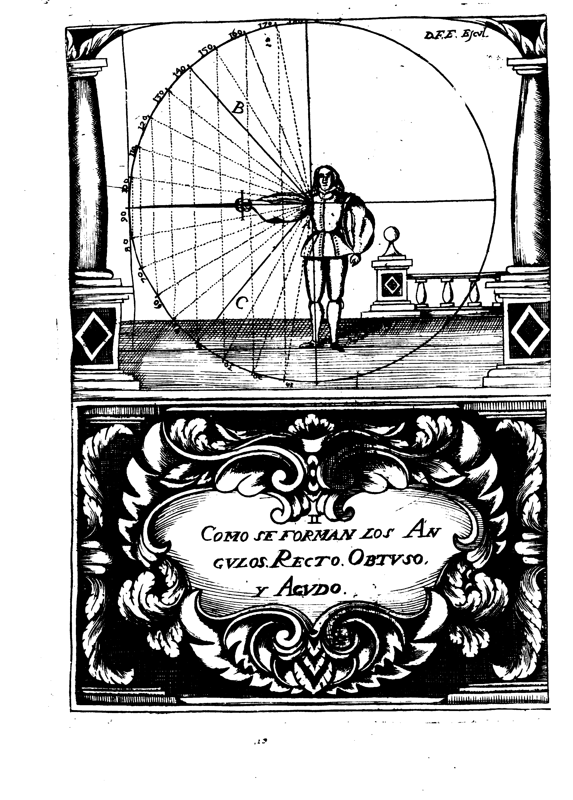

# TRATADO SEGUNDO,
## de la declaracion de los Principios Fundamentales, y Universales de esta Ciencia.

## CAPITULO PRIMERO
### De como se debe considerar al Diestro en la formacion de los Angulos, Recto, Obtuso, y Agudo.

Lo primero que se debe trarar, es del modo de formar los Angulos, con la aplicacion de las medidas Geometricas; y dando principio a ello, digo: Que el Diestro forma Angulo Recto, quando se afirma con el cuerpo derecho, y perpendicular, como naturamente cae sobre ambos {p. 14} pies, dexando de capacidad entre un talon, y otro la distancia de medio pie: y luego tendiendo el braco, y Espada, recta, y derechamante, como nace del cuerpo, llegando con la punta al numero de los noventa grados, que son los que le tocan, por comprehender en su capacidad la quatra parte de la circunferencia, siendo el punto del concurso debaxo del braco, donde se junta con el costado, y senala la letra (A).

Esta es la posicion, y planta que siempre debe observar, por ser la de mayor alcance, y defensa, y centro de todas la demas. 

El Angulo Obtusi es de mayor capacidad que el Recto, por comprehender mas que la quarta parte del circulo: Darasele el valor, conforme los grados que el tocaren.
Alcanca menos que el Recto: con advertencia, que quanto mas Obtuso fuere siendo, ira alcancando menos.
El Diestro le forma, quando sube la espada a ocupar {p. 15} la Linea (B) y rendra el valor de ciento y quarenta grados, que son los que comprehende.

El Angulo, es demenor capacidad que el Recto; por no llegar a la quatra parte de la Circunferencia, es tanmbien de menos alcance.
Dasele el valor, segun en los grados que se halla.
El Diestro le forma, quando baja la Espada a ocupar la Linea que senala la letra (C) y valdra por quarenta grados, que son los que le tocan.
En la figuiente Demostracion se manifiesta con toda claridad.

Conviniente sera, pues se ha conseguido el constituir al Diestro en la planta mas perfecta, que es en razon de Angulo Recto (y ser la posicion que siempre se ha de observar) nos demuestre las demas partes donde se puede afirmar consu contrario; pero pues es precisio, que para quitar la Espada de lugar adonde se halla, y ponerla en otro, aya de aver movimiento, y de el, y sus especies falte la noticia, sera bien difinir primero, que cosa es, quantas especies ay, y a que pocision se va con cada una: y para que con mayor facilidad se pueda llegar a este conocimiento, sera bien hacer una figura demonstrativa, por la qual se sabra, que solo en seis partes se puede afirmar el Diestro, que son la Rectitudines Generales, sin que sea possible que en qualquiera parte que este, dexe de participar de alguna de las seis, precediendo para ir la Espada a cada unda movimiento distinto, y asi se prueba.
