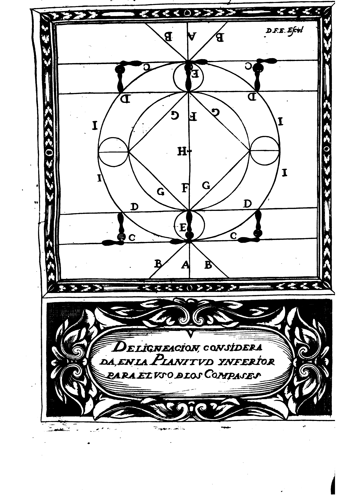
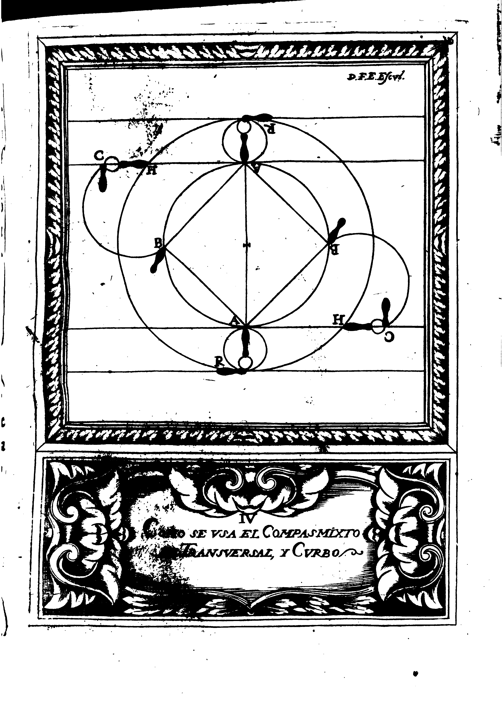

## CAPITULO IIII.
### De la Difinicion del Compas, y sus Especies.

Compases un Movimiento que hace el cuerpo, quando dexa un lugar para ocupar otro: y para mayor claridad, es cierto que dar un Compas, es lo mismo que dar un paso: es genero, y tiene cinco especies simples, cuyos nombres son, Recto, Curbo, Transversal de Trepidacion, y Estraño: Otros dos ay Mixtos, que son el de Trepidacion, y Estraño, y el de Transversal, y Curbo; pero para su declaracion, y conocimiento, se necessita de la Demostracion del Circulo que se imagina entre los dos Cobatietes: y hecho, se pue de co suma facilidad difinir cada especie de las referidas, y luego se tratara de los Mixtos de Transversal, y Curbo, y de {p. 51} Trepidacion, y Estraño, dando las noticias que poraora fueren convenientes, perp en primer lugar, es forcosa, y precisa la explicacion de la presente Figura, segun su deligneacion.

	(A) Linea Recta, para el Compas Estraño.
	(B) Lineas intermedias.
	(C) Linea infinita del pie izquierdo.
	(D) Linea infinita del pie derecho.
	(E) Centro propio.
	(F) Linea del Diametro.
	(G) Lineas Rectas que forman los Angulos Rectos.
	(H) Centro de la comun distancia.
	(I)	Linea de la Circunferencia Operiferia.

{p. 55}

El Compas Recto, es el que se dapor la Linea de el DIametro que atraviesa, y divide el Circulo en dos partes iguales, como se ve en la Demostracion, donde senala la letra (F): Dale principio el pie derecho, y le figue el izquirdo.

El Compas Curbo, se da por la Linea Curba, de qualquiera lado de la circunferecia que senala la letra (I).
Pueden formar le ambos pies, cada uno por la parte que le tocare.

El Compas Trensversal, se forma por qualquiera de las Lineas Rectas que forman los Angulos Rectilineos, donde senala la (G) con la distincion de derecho, e izquierdo; y solo al pie derecho toca su formacion.

El Compas Estraño, o Retrocedente, es el que se da por la Linea Recta que va a la parte de atras, donde senala la (A): y solo toca su execucion al pie izquerdo.

El Compas de Trepidacio se forma por {p. 56} las Lineas Rectas, que llamamos Infinitas, que senalan las letras (D) y (C): puede empecarse a formar con ambos pies.

El Compas Mixto de Trepidacion, y Estraño, se da por la Linea Recta Intermedia, que esta entre la Infinita, y la Recta, por dode se da el Estraño (B).
Y porque participa de las dos especies, se la da este nombre: puede empecarle qualquiera de los dos pies.

El Compas Mixto de Transversal, y Curbo, sirve (?) para hacer Movimiento de Conclusion, y solo se puede formar por el lado izquierdo del Actor.
Empiecale el pie derecho, y tambien la acaba.
Es Compas que pide Demostracion aparte, para la facilidad de su inteligencia: y por ser cosa de mucha importancia su conocimiento, para el uso de la verdader Destreca, no me parece dexar de demonstrarle como se figue.

{p. 59}

Confacilidad se compehende por medio de la Demostracion presente el modo de la formacio del Compas Mixto de Tresversal, y Curbo, pues se ve que se empieca con el pie derecho, dando el Trensversal por la Linea Recta desde el Punto (A) al Punto (B) y afirmandose en el pasa el pie izquierdo, formando Compas Curbo por la circunferencia desde el Punto (R) al Punto (H) llegando a ocupar la Linea Infinita del contrario; y luego afirmandose en el acaba el derecho, formando tembien Compas Curbo, pasando desde el Punto (B) hasta el Punto (C) poniendole detras del izquierdo, en la misma Linea Infinita de el contrario: y conmosu composicion consta de las dos especies sinmples, se hace el Mixto, como queda significado.

El determinar cantidad fixa a los Compases, para obrar las proposiciones, lo tengo por cosa sumamente dificil (y aun imossible) por que como las distancias se proporcionan {p. 60}, acortando el Diestro su Compas, todo lo que el contrario huviere (?) alargado el suyo: y el formarle largo, o corto sea asi en el uno, como en el otro Acto voluntario, y no preciso, no se puede dar punto fixo a lo que no le puede dar de quatro, y de uno.
Solo en un caso se pudiera conseguir, y es, si el uno de los Combatientes estuviera sin moverse de su lugar, que respeto de no aterar las distincias, se podian proponer cantidades fixas para el uso de los Compases.
Pero biese reconoce que dificil es la cosideracion de un contrario inmovil; con que me ratifico en mi dictame, que a u que nuestro Mestro D. Luis Pacheco de Narbaez les dio tres medidas, y para su distincion los nombro Compas doble, o paso Geometrico, Compas Sensillo, y pasada; dandole al doble cinco pies de longitud, el uno de macico (q es donde hace assiento el pie) y los quatro de hueco: al sencillo tres, uno de macico {p. 61} y dos de hueco: y a la pasada dos, el uno macico, y el otro hueco; con todo no es bastante para que no se puedan formar de seis, de  quatro, y de uno: con que absolutamente digo, que solo el conocimiento, y capacidad de los Combatientes podran medir proporcionadamente las distancias, teniendo por regla general, que si el contrario diere los Compases largos, el Diestro los ha de dar cortos, supliendo el uno la desproporcion del otro, y se conseguira la perfeccion en el modo de formarlos: Y pues no ay cosa alguna (tocante a esta materia de Compases) que poder declarar hasta otra ocasion en que bolvamos a tratar de ellos, sera bien prosequir, demonstrando, y dando noticia de la division, y graduacion de la Espada, por ser uno de los mas fundamentales principios de esta Ciencia, y muy importante, y necessario su conocimiento, para conseguir la defensa propia, y ofensa del contrario.
