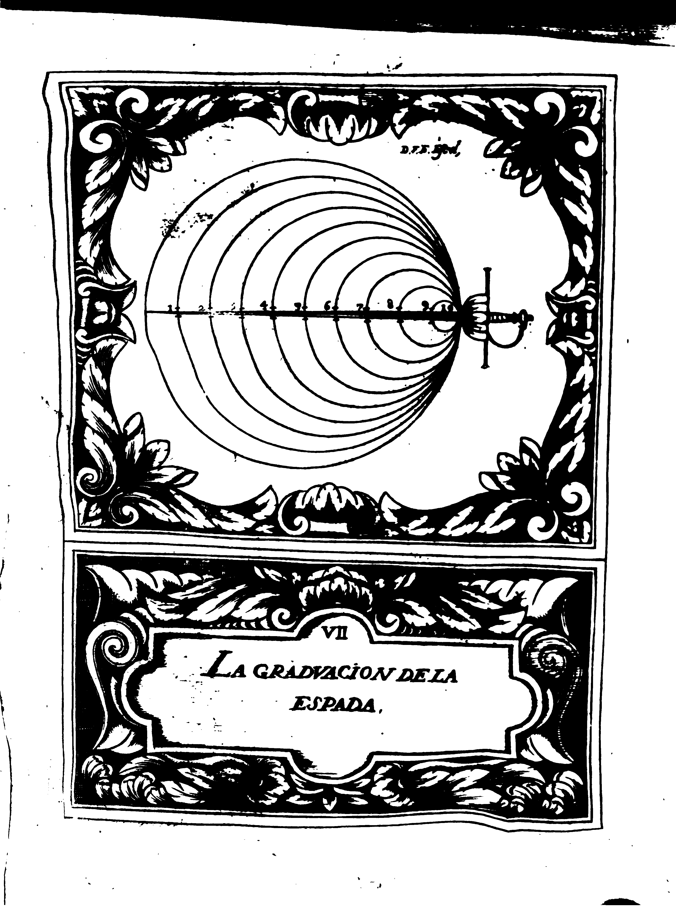

## CAPITULO V.
### De la Divisio, y Graduacio de la Espada

La presente Demonstracio, ensena la Graduacio de Fuerca que en la Espada se debe considerar; y para ello se pone dividida en diez partes iguales, a quien lamamos Grados, empecando desde la punta por el numero primero, hasta la guarnicion al numero diez, advirtiedo, que coforme se fuere aumentado los grados, asi se ira aumentado la fierca.
La razo es clara, y natural, porque como el cuerpo es cetro de la fuerca, y este la comunica a la Espada, por medio del braco, es cierto que aquella parte, o grado que mas cercano estuviere a el, tendra mas fuerca, por estar mas proximo al orige, y que todo aquello que se fueren desviando, iran perdiendo la fortaleza, y valor: por lo qual el numero primero, es ei Grado de mas flaqueza (?), por ser tambien el que mas distante se halla del cuerpo.

{p. 65}

La experiencia nos manifestara la grandeza de este fundamento, y lo preciso de su conocimiento, y especulacion; pues por el tiene el Diestro a su disposicion, y voluntad el poder disminuir la fuerza a su contrario, y aumentarse a si la que por naturaleza le faltare: y para ser mejor asegurada esta proposicion, le puede considerar con la Espada igual en longitudl y graduacion, y que llega a comunicarle la suya, haziendo tocamento en ella, con numero seis, sombre numero cinco.
Con que biene a estar el Diestro en un grado mas de flaqueza (?), y su cotrario en uno mas de fuerza.
Y en este caso debe graduarse, poniendo su Espada numero siete, sobre tres de la contraria, aumentando conesto su fuerca, todo lo que abentaja en numero, que son quatro grados, quedando con otros tantos de disminucion el contrario.
Y asi se ha de tener por Regla General, que los mayores numeros, tienen superioridad sobre los menores; y con esta {p. 66} advertencia se ha de procurar poner siempre los mas sobre los menos, y se conseguira el estar superiormente graduado, y defendido.

Sentados estos principios, que comprehenden en universal todo lo que en esta Ciencia se puede tratar, me parece se ofrece una dificultad, tan claramente manidiesta, que sino la desvanecemos, sera muy possible que algunos queden en el escrupulo que ocasiona; y es, que come esta Ciencia tiene por particular sin, el procurar la defensa propia, y ofensa del contrario (caso que conuenga para la defensa) y esto sea ta distinto lo uno de lo otro, por estar en los estremos, parace que con solos unos principios , no se pueden comprehender dos cosas tan opuestas, que bastava que aprovechassen para una de las dos, defensa, u ofensa, y que se diesen otros preceptos para la contraria: pero como lo universal lo comprehende todo (que a no ser asi los llamaramos {p. 67} particulares) es cierto que debaxo de estos mismos principios, se halla la conveniente contrariedad, por la desigualdad, y oposicion que se experimenta entre sus especies, y aun en una sola, meiente la graduacion, o la medida del tiempo; pero para quitar qualquiera genero de duda, ha de ser preciso ir declarando las oposiciones, y quedara desvanecida la proposicion, con lo qual podremos proseguir sin embaraco.

