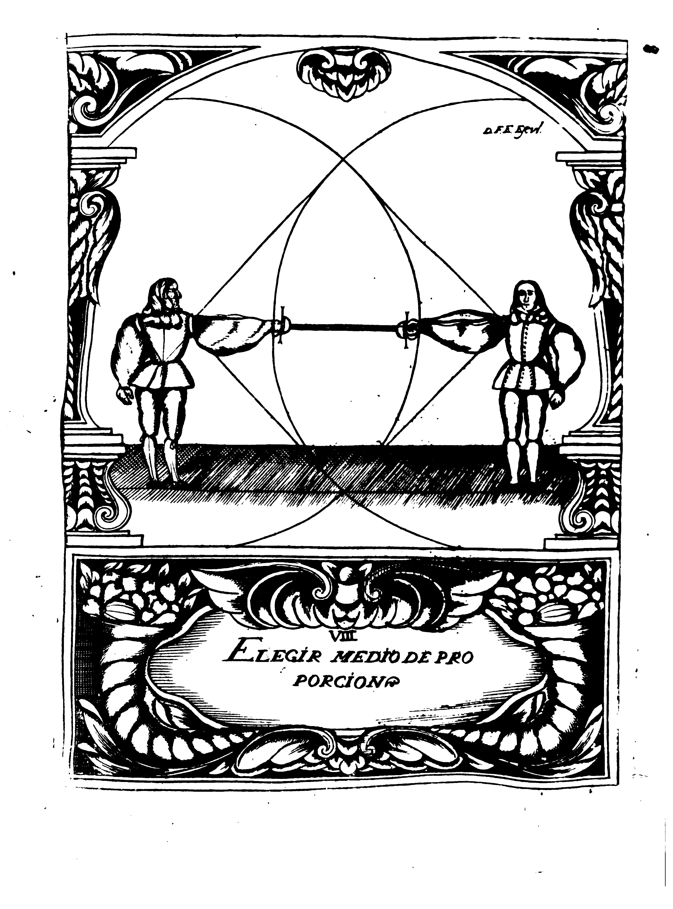

## CAPITULO I
### De como se debe elegir Medio de Proporcion

Elegir Medio de Proporcion, es determinar una destancia proporcionalda, y combeniete, desde la qual puede el Diestro reconocer los movimientos del contrario, pues para qualquiera determinacion suya, han de preceder, asi de cuerpo, como de braco, y Espada.
De cuerpo, mediante compas: y de Espada, mnediante formacion de Treta.

El modo de conseguirlo, esena la siguiente Demostracion, pues claramente manifiesta, que para no errar (antes bien para conseguir con perfeccion el acierto) ha de medir el Diestro su Espada con la del contrario, de suerte que no pase la punta del pomo, sirviendo esta prevencion, no solo para {p. 71} reconocer los Movimientos, sino para saber si la Espada contraria excede en longitud ala suya.
Tambien se debe estar en conocimiento, de que si los dos Combatientes se hallaren con Armas iguales, el que primero elige Medio, lo hace para ambos, y se llama Medio de Proporcion Propio, y Apropiado, por aver en un tiempo tomado el Diestro para si, y ofrecido a su contrario una misma disposicio; pero si alguno de los dos trae la Espada mas larga, y le elige en la forma que se ha dicho, se llama Medio de Proporcion Propio, por aver sido la Eleccion para el solo, quedando el otro desproporcionado.
Y si el que traw la Espada corta, llega la punta a la guarnicion contraria, se llama Medio de Proporcion Apropiado, porque le Apropia, y ofrece el Medio que el no avia elegido, pero aunque se debe estar en conocimiento de todo esto, solo se demonstrara la eleccion de Armas iguales, por ser de la que aora hemos de ufar.

{p. 75}

En el sin del Medio de Proporcion, tiene principio el Proporcionad, por ser preciso que dexe de ser el uno, para que empiece a ser el otro, y para venir mejor en su conocimiento, es necessario entender, que el Medio Proporcionado, es una distancia, que el Diestro determina, desde la qual puerde herir a su contrario, quedando el defendido: no es, ni puede ser uno solo, porque como se ofrecen deferentes disposiciones de herir, ne se pueden comprehender todas con solo uno: con que es preciso, que para qualquiera especie de Treta, aya de aver Medio Proporcionado difinito teniendo por cierto, que todas las vezes que se estuviere en puesto desde donde se pueda ofender, quedando defendido, se ha logrado el tenerle conveniente.

Tres modos ay de conseguir este Medio, a quien llamamos, Propio, Apropiado, y Trasferido.
El medio Proporcionado Propio, es el que el Diestro adquiere por si solo, qunado {p. 76} el contrario le espera.
El Aproiado, es el que ofrece el contrario, quando consus Movimientos da disposicion de herir sin riesgo.
Y el Trasferido, es el que el Diestro quita a su contrario, oponiendo le sus Compases, y Movimientos, de suerte que viene a tomar para si el Medio que el otro buscava.

Considerando nuestro Maestro su realidad, dize: Que se llama Propieente Medio, porque carece de todos los estemos.
Proporcionado, porque el movimiento que el Diestro heziiere, ha de ser con tal medida que ni sobre en losuperfluo, ni falte en lo necessario.
y para mas ponderar su grande za digo; que es cierto, que el que llega a constituirse en el con perfeccion, consigue el sin de esta Ciencia, pues no es otro que el que ofrece este medio, asegurando la defensa propia, y ofensa del contrario.
Y asi, puesto, y recapacitado el Diestro, en lo que para adquirir conocimiento de la importancia {p. 77} de estos medios queda advertido, se proseguira, manifestando la oposicion de los Angulos, y de los demas Fundamentos, como por su orden se fueren siguiendo.
