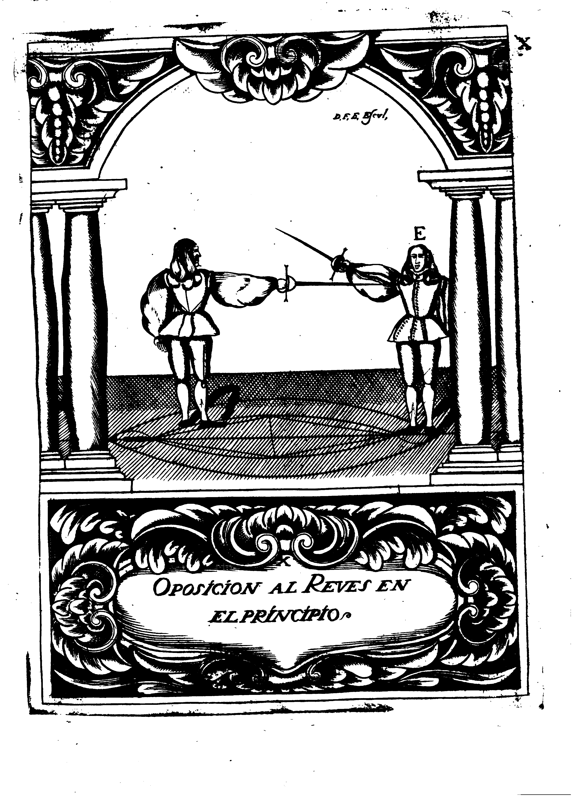
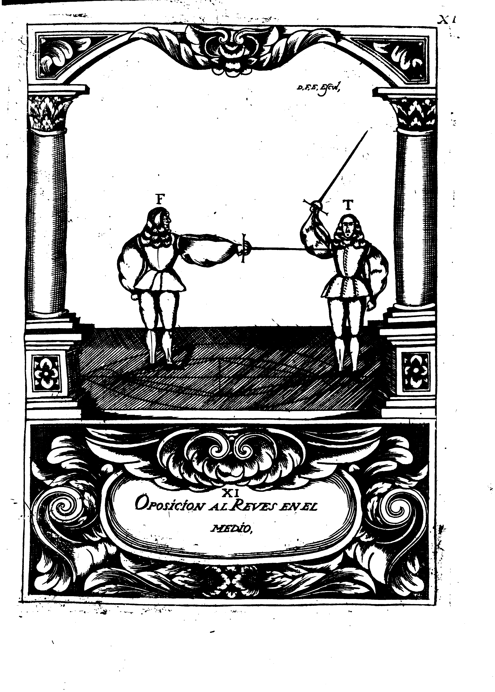
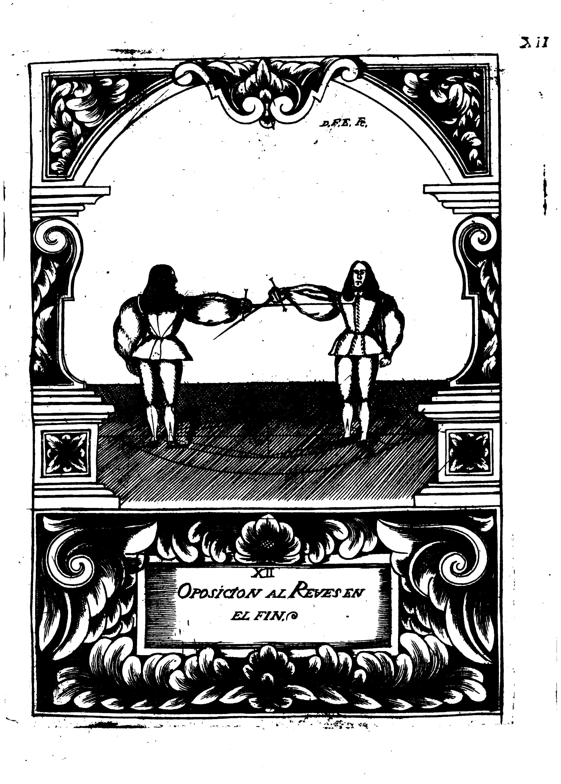

## CAPITULO IIII
## De la Oposicion de las Tretas

Los Tajos, y Reveses Verticales, y Diagonales, tinene unos mismos Movimientos dispositivos, que como ya queda referido, son el Remiso, y el Violento, para que execute el Natural.
La Estocada tambien se esta en fixo conocimiento, de que su formacion toca, solo al Movimiento Accidental.
Y asi mismo es tambien constante, e indubitable la oposicion que este hace a los otros.
Con que parece no queda que dudar en que la Treta de Estocada se oponga a las de Tajos, y Reveses, executando herida; pues por tan evidente razon se da a entender, segun los movimientos de su composicion.

{p. 91}

Para los medios Tajos, y medios Reveses, dispone tambien el Movimiento Remiso, para la execucion de el de reduccion; y por esta razon se les opone la Treta de Estocada con el Movimiento Accidental: y lo mismo se entiende de los Altibaxos, que por tener principio con el Movimiento Violento, estan sugetos a la misma oposicion, no admitiendo duda, ni reparo alguno esta proposicion, por ser evidente verdad, que antes ha de tener execucion una Treta, cuya formacion va por una Linea Recta, a constituir herida con solo un Movimiento executante que una que para disponer la execucion, han de preceder dos dispositivos, y viene a constar de tres Movimientos, y se forma con una Accion, cuyo progreso descrive un Circulo, por cuya cusa a todas las Tretas de Tajos, y Reveses Verticales, y Diagonales, se les da el nombre de Movimientos Circulares; y a la Estocadada, de Recto, siendo este, sinduda, el que con realidad {p. 92} se opone a los otros; pero para mayor satisfacion de lo propusto, sera bien conveniente Difinir, y Demostrar el modo de herir, que para mas facilidad de la inteligencia, llamamos de segunda intencion, o en tiempo, porque se forma, gozando de los Movimientos del contrario, en el tiempo que esta obrando, sirviendo esta advertencia, no solo para ensenar a gozar de ellos, sino para asegurar la verdad de lo tratado, con la evidencia de las Demostraciones que se han de formar.

Herir en tiempo (como ya se ha dicho) es quando para executar, se goza del Movimiento contrario, pero para mas claridad, pongo por exemplo, que el Diestro comunica la Espada de su contrario por la parte de adentro; y que el entonces quiere formar un Reves: y dandole principio con los Movimientos dispositivos, Remiso, y Violanto, al mismo punto, gozando el Diestro del tiempo en que los va obrando, camina con {p. 93} el Compas Transversal a su lado izquierdo: y en razon de angulo Recto, con el Movimiento Accidental, constituye herida de Estocada en la Linia Colateral derecha, quedando la Espada contraria en el progreso de la formacion de su Treta, sin correspondencia, ni alcance a Punto de Tocamento alguno; como en la presente Domstracion se manifiesta.
Con advertencia, que la Figura que senala la letra (E) sue la obligada a la formacion del Reves, y esta obrando el Acto primero, que es el Movimiento Remiso: y quando se hiere en su tiempo, se hace la oposicion con la Estocada al Reves en su principio, por tenerle con este Movimiento.

{p. 97}

En esta segunda Demostracion, se representa por la Figura (F) el modo de oponer el Reves en el medio de su formacion; pues se ve que esta executando la herida en el tiempo que la Figura (T) esta obrando el Acto segundo, que es el Movimiento Violento, deviendo ser la execucion, en la quarta parte del Circulo, en el tocamento de la Linea Vertical, debaxo del braco, a quien propiamente llamamos, para nuestra inteligencia, Estocada Sagita, o Instantanea, porque ha de ser executada con toda la prontitud possible, y falir luego al medio de Proporcion, para asegurarse de qualquiera peligrosa igualdad.

{p. 101}

En el fin del Reves se hace tambien la oposicion con la Treta de Estocada, pero es con sugecion de Espada, a yudando a bajar el Movimiento Natural con otro de su misma especie; y despues sin desagregarse, se executa la herida en la forma que la Demostracion ensena, y a este modo de herir, se llama despues de tiempo, por tener execucion, despues de aver destruido el ultimo Movimiento, d la Treta del contrario, que como en el tiene fin el tiempo de su formacion, se le da este nombre.
En la presente Demostracion se representa con toda facilidad, el modo de ponerlo en Practica, junto con el conocimiento, de que el Circulo demostrado entre los dos Combatientes, ensena a conocer la especie de Compas, que para la execution perfecta de la Trera se ha de dar: pues conforme en la Linea que tuviere los pies el operante, se sabra el Compas que ha dado: y {p. 102} prevengo tambien, que al punto que la herida aya tenido execucion, se ha de salir otra vez al Medio de Proporcion.

{p. 105}

En esta misma conformidad, deben ser opuestos los Tajos: con dos diferencias.
La una, que la agregacion de Espada que se ha de hace, para estorbar la execucion al Movimiento Natural, ha de ser por la parte de adentro.
Y la otra, que en la oposicion que se hace en el principio, y medio, se ha de herir en la quarta parte del Circulo, en el Tocamento de la Linea Vertical, debajo del braco derecho del contrario, observando siempre el caminar con el Compas Transversal del lado izquierdo, en principio, medio, y fin, y seguir en todo lo demas el orden de la oposicion de los Reveses.
Y manifestando mi parecer, digo, que precisamente, donde ay Movimiento Remiso, y Violento, ha de aver disminucion de alcanze, por la participacion del Angulo Obtuso: descorrespondencia de los puntos de Tocamento del contrario, y pribacion, e impossiblidad de herir con ellos; teniendo el accidental la preeminencia en todo, pues se obra con el {p. 106} mayor alcance, en razon de Angulo Recto, y camina a Punto correspondiente, y es por se solo capaz de poder herir sin dispositivo.
Con que so todas las otras quatro Tretas tienen sus principios con los referidos Movimientos, por evidente, y bien fundada razon son opuestas de la Estocada que solo se compone del Accidental, siendo siempre, en midictamen, lo mas acerado, oponer la Treta de menos Movimientos a la de mas: caminar antes por el breve camino, que por el dilatado, para conseguir llegar mas presto, y oponer los Movimientos executantes a los dispositivos, y abran seguros sucesos.

Por sumamente deficil tengo el conseguir acierto en la oposicion de los Tajos, y Reveses Verticales, y Diagonales, con los de su misma especie: porque si los dos Combatientes son iguales en promptitud, y legereza, siendolo tambien las Tretas, y empecando las a formar en un mismo tiempo, {p. 107} es sin duda, que caminaran con igualdad en los principios, medios, y fines, llegando a herir se los dos en un tiempo, pues siempre se debe esperar de semejantes causas, la igualdad en los efectos.
Y aunque entre los dos sugetos no huviese proporcion, era tambien la oposicion impossible; porque el que fuere mas presto, llegara su execucion antes: con que no sera bastante la Treta que opusiere el contrario, para estorbar estotra, por aver llegado antes a conseguir fin perfecto, que es la execucion de la herida.

La razon que mas legitimamente pudiera satisfacer, era dezir, que se puede oponer un Tajo, o un Reces, con una diferencia, que el Movimiento Circular que formase el Diestro, fuese de menos progreso que el que formase su contrario; y que por tener menos distancia que caminar, es cierto se podra oponer, llegando antes a formar herida, que la que tuviese que andar mas dilatado camino: pero como para esto sea {p. 108} preciso saber la cantidad de la accion Circular que ha de formar su contrario, para desvanecerle, e impedirle la execucion con otra de menos intrvalo; y este conocimiento solo se pueda adquirir despues de aver reducido en Acto la Treta, y antes no, por no aver llegado al fin ultimado, es impossible hacer la oposicion segura; pues como puede descrivir un Circulo grande, le puede formar pequeno, por estar en potencia de disponer a su voluntad lo que mas conveniente le pareciere a su defenda; con que siempre se ira, expuestos a la contingencia.
Y si a caso sucede el conseguirlo, es por accidente, y no por cierta ciencia, como la oposicion de la Estocada, que es infalible; y por ultimo, siguiendo el parecer de nuestro Maestro D. Luis Pacheco de Narbaez, se hallaran que asi leman fiesta en sus Escritos, pues en el Aforismo 68 dize: Que a las Tretas de Tajo, y Reves Diagonal, no pretenda el Diestro des hacer las con otra de su especie, {p. 109} que no sera possible; porque si el contrario las formare desde adentio, solo el Movimiento de Conclusion tienen por remedio: y si de afuera, el Atajo, y el Angulo Recto, y que no busque mas el Diestro, porque no le hallaran.
Y para que con mas firmeza que de aprobado este dictamen, referiren tambien lo que dize en el libro que intitulon,Engano, y Desengano de la Destreza, en el fol. 189 donde declara, que siempre doctrino, y aconsejo que se hiriese con Treta contraria, y no de su misma especie.
Y luego (en este mismo folio) cita la conclusion 96 en que dize: que el reparo perfecto ha de nacer de la herida, pero que no es preciso que sea de la misma especie: y que aunque aya quien aconseje lo contrario, tendra mas de muentiva, que de consentimiento, y aprobacion.
Y concluyo, diziendo: que para conseguir buen logro en la oposicion de los Tajos, y Reveses, Verticales, y {p. 110} Diagonales, se les ha de oponer el Angulo Recto, hiriendo de Estocada, por medio de el Movimiento Accidental: y que mi intencion no es introducir inuenticas peligrosas, sino seguridades evidentes.
Y porque firmemente reconozco ser lo mas facil, y seguro lo que queda declarado, e infaliblemente demostrado, tengo por mejor escusar la eleccion de cosas expuestas a la igualdad, y contingencia; pues asi lo uno, como lo otro es sumamente peligroso.

El medio Reves de dos Movimientos, se puede oponer al Reves en el fin de su formacion, procurando siempre la superioridad de grados en el encuentro de la Espada contraria, para poder estorbar los efectos del Movimiento Natural.

El medio Tajo, se opone al Tajo en la misma conformidad: solo que el encuentro de las Espadas debe hacer se por la parte de adentro, caminando con el Compas Transversal del lado izquierdo: y asi, pues con {p. 111} toda satisfacion queda asegurado lo fundamental, e infalible de las oposiciones que para lo que toca a este Punto se han aprobado: y tambien del conocido riesgo que ay en querer observar otras de las que se han exluido con todo fundamento de razon, pasare a tratar de la conveniente contrariedad de los Compases, segun se experimenta en sus especies, para mejor poder observar los preceptos de obrar, conforme a verdadera Destreza, procurando siempre la desigualdad, en todo lo que entre los dos Combatientes se ofreciere.

