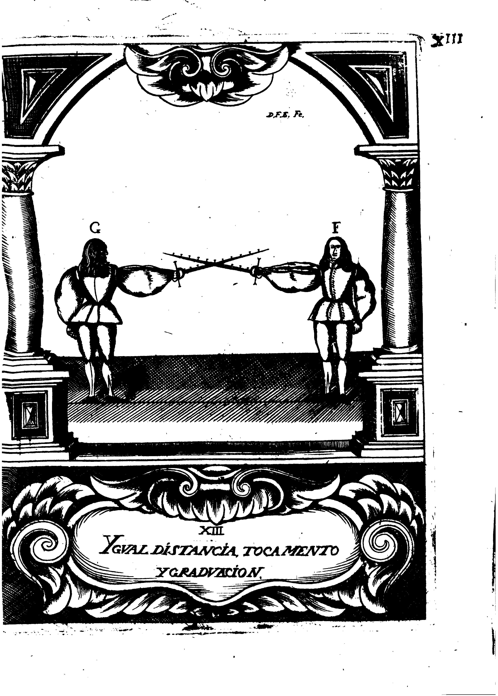

## CAPITULO VI
### De la Oposicion de los Grados de la Espada

En la declaracion de lo importante, que es el conocimiento de la Demostracion de los Grados de Espada, se dio bastantemente a entender la oposicion que unos a otros se hacen; pues el mayor numero, tiene superioridad sobre el menor, y se le opone, y vence con su mayor fortaleza: y en esta consideracion, dire los efectos que ocasiona esta disposicion, y la importancia de su observacion, para conseguir aciertos en las questiones de la verdadera, e infalible Destreza; pues mediante esta oposicion, se hacen los Movimientos, que llamamos de Aumento, y Desminucion de fuerca violentando con ellos la naturaleza de los Movimientos Violento, y Natural: {p. 115} pero antes de ponerlo en execucion, sera conveniente hacer una Demostracion que manifieste a los dos Combatientes, con la Espadas igualmente graduadas, y hecho tocamento en iguales grados, que sera sumamente importante para la facilidad de la explicacion, y clara inteligencia del Diestro, y se considera en la siguinete Figura.

{p. 119}

En consideracion de la Igualdad que por la Demostracion se reconoce entre los dos Combatientes, se puede adquirir el conocimiento del Movimiento de aumento, que es el que se hace para graduar la Espada: y como por esta razon se adquiere, y aumento mas fuerca, se lada con propiedad este nombre, pero no porque sea de diferente especie de las referidas en los principios que quedan difinidos, pues esta accion toca (con mas acierto que a otro alguno) al Movimiento Mixto de Remiso, y Violento.

El Movimiento de Diminucion, es el que se hace para disminuir la fuerca, desgraduando la Espada, cuya accion toca legitimamente al Movimiento Mixto de Rediccion, y Natural: de suerte, que si la Figura (F) que tiene su Espada sobre la contraria, hecho tocamento numero 5. superior sobre el mismo numero inferior, haciendo este Movimiento, la midase de forma que pusiese numero tres fobre och, hara Movimiento {p. 120} de diminucion para si, y de aumento para el contrario; porque con sola una accion,se desgradua el uno, y apropia la graduacion al otro, ofreciendole hecho el Movimiento de aumento; y por el contrario, si la Figura (G) haciendo graduacion con el Movimiento Mixto de Remiso, y Violento, pusiese su Espada de suerte, que el numero tres de la contraria, cayga sobre ocho de la suya, avra hecho Movimiento de aumento para si, y de diminucion para el contrario, teniendo por firme, que al mismo Punto que el une se va graduando, va desgraduando al otro: y asi se debe entender lo mismo (en la execucion de estos Movimientos) que en el modo de eligir medio de Proporcion, se advierte, haciendo deferencia de quando el Diestro le elige por si, o quando se le ofrece eligido al contrario, diziendo al uno Propio, y al otro Apropiado; pues el Movimiento de aumento propio que hace el Diestro, ofrece al contrario el {p. 121} de diminucion Apropiado: y el de diminucion Propio, de Apropiado al contrario el de aumento.

Que por esta razon pueda el Diestro violentar la naturaleza de los Movimientos Violento, y Natural, no es materia reparable; porque aungue el Movimiento natural es el mas fuerte, prompto, y veloz; y el Violento es el mas tardo, torpe, y flaco, y que por naturaleza ha de ser vencido, y opuesto del Natural, siendole en todo inferior, no obstante (aunque la proposicion parece innegable) si se hace distincion de grados, se reconocera evidentemente, que por esta causa se le puede quitar el superior poder al Movimiento Natural, y se le minora su fortaleza, supliendo el Arte en el Violento (para que no sea vencido) los defectos de su naturaleza.
La misma Demostracion lo ha de dar a entender con toda satisfacion; porque la Figura (F) esta con la Espada superior a la de la Figura (G) no por estar mas graduada {p. 122}, sino por estar haciendo Movimiento Natural, a cuya accion llamaros, Fuerca Operante, con que la contraria, es obligada a resistir con el Violento, a quien dezimos Fuerca Resistente: y por las razones tan fundamentales que quedan dichas, no admite duda que sera vencido, destruido del Natural, por ser de ningun valor su resistencia, para tan grande impulso; pero si como ay igualdad en la graduacion, no la huviese, sino que la Espada superior se pusiese con numero tres, sobre ocho de la inferior, se reconoceria en tal caso, que no podria vencer el Movimiento Natural al Violento, por suplir a lo flaco de su naturaleza la fuerza, de los mayores grados; y que con esto conseguia el Diestro, por este medio, el desminuir poder a un Movimiento, cuya potestad excede a todas las demas especies, y aumentar fortaleza a otro, que por si estaco, y tardo es su execucion.
Con que me parece aver satisfecho con bastante prueba {p. 123}, la proposion, de que por la graduacion de Espada, se alterava, y violentava la naturaleza de estos dos Movimientos, no siendo possible, que por ninguna otra disposicion, sea factible el poderlo conseguir; pero no obstante, para que con mas autoridad quede asegurado, refiero al Aforismo setenta, que dize: Que el Movimiento mas noble, mas poderoso, y fuerte que tiene el Diestro, para su defensa, y ofensa del contrario sea para herir por si, o mediato para otro, es el Natural; este es superior a los demas, y los sugeta, y destuye, sin que por otro de diferente, o contraria especie, pueda ser corrompido, destruido, ni dibertido: y que si el Diestro usa de el, como debe, faldra vencedor; pero que si de otro fuese vencido, sera por accidente en el contacto de las Espadas, segun donde se tocaren, y no por naturaleza.
Y por esto digo, que tiene prevenido el Arte la graduacion, que la violenta, y fuerca a que sus efectos se desvanezcan {p. 124}, y no obren, segun su naturaleza.

Premio sera de mi buen deseo, aver acertado la explicacion de los principios, y fundamentos de esta Ciencia, con la claridad que es necesario; pues siendo asi, sera cierto el aprovechmiento de los que exprofeso se dedicaren a su especulacion, y en mi el logro del trabajo, quedando deudor a mi fortuna de justos agradecimientos, si merezco consequirlo.
Y porque todo lo que en adelante se fuere explicando, se ha de probar, no ser otra cosa que lo que queda declarado (aunque para mejor darlo a entender se trate con otros terminos) pido encarecidamente, se este en fixo concimiento de todo, y muy enterados, y recapacitados en las advertencias que se han hecho, y medir, y ajustar las Demostraciones puestas en practica, para que con la luz que por su medio da claridad al entendimiento, se puedan prevenir mejor los preceptos que se fueren manifestando, y las proposiciones {p. 125} que se fueren haciendo, no pasandose cosa alguna encubierta con la confusion, que la falta de inteligencia suele ocasionar.
Y porque me parece inutil, y sin provecho el trabajo de lo que hasta aqui queda manifiesto, si falta la noticia de las disposiciones, por donde se consiguen (con acierto, y perfecion los medios proporcionados) que aseguran la defendsa propia, y ofensa del contrario quiero, para conseguir mi intento, dar principio a su declaracion, llevando siempre por incontrastable defensa de mis proposiciones, la aprobacion, y parezer de nuestro Maestro Don Luis Pacheco de Narbaez, asi en lo que admitiere por bueno, como en lo que reprobare par malo: que de esta suerte tengo por infalible, que quederan mis Dictamenes inuenciblemente asegurados.

